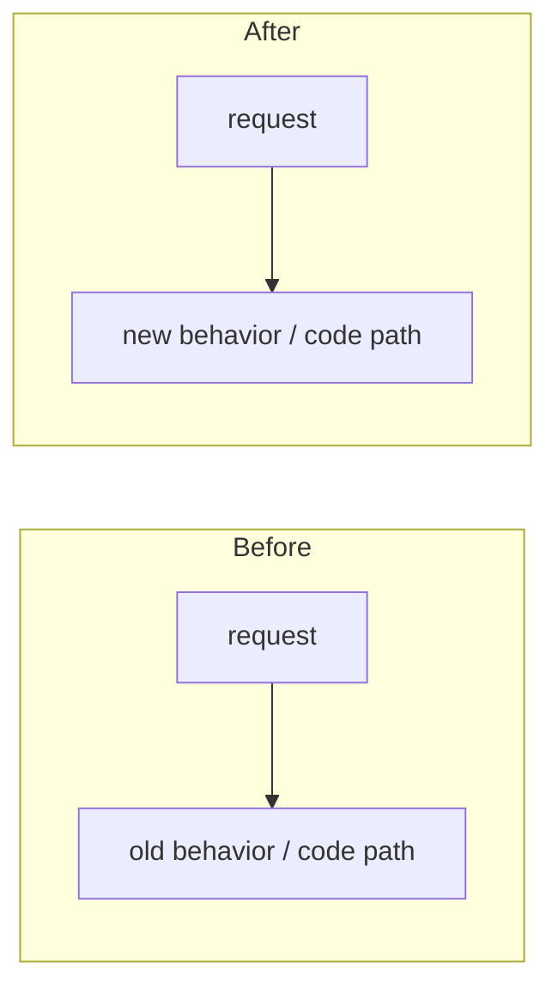

# Darkbloom - Decentralized Private Inference

Darkbloom is a decentralized private inference network for Apple Silicon Macs. Consumers use OpenAI-compatible APIs, the coordinator handles routing, auth, billing, attestation, and capacity management, and providers run local inference workloads on macOS hardware using MLX-Swift. All inference is end-to-end encrypted -- the coordinator never sees plaintext prompts.

## Project Structure

```text
coordinator/          Go control plane (packages live at top level, not internal/)
├── cmd/coordinator/  main service entrypoint
├── api/              HTTP + WebSocket handlers
│   ├── consumer.go         OpenAI-compatible chat/completions/messages/transcriptions/images
│   ├── provider.go         provider registration, heartbeats, attestation, relay
│   ├── billing_handlers.go Stripe/Solana/referral/pricing endpoints
│   ├── device_auth.go      device code flow for linking providers to user accounts
│   ├── enroll.go           MDM + ACME enrollment profile generation
│   ├── invite_handlers.go  invite code admin/user flows
│   ├── release_handlers.go binary release registration (GitHub Actions integration)
│   ├── acme_verify.go      ACME device-attest-01 client cert verification
│   ├── stats.go            public network stats
│   └── server.go           route wiring, auth middleware, version gate
├── attestation/      Secure Enclave + MDA verification
├── auth/             Privy JWT integration
├── billing/          Stripe, referrals
├── e2e/              X25519 request-encryption helpers
├── mdm/              MicroMDM client + webhook handling
├── payments/         ledger + pricing
├── protocol/         WebSocket message types shared with provider
├── ratelimit/        rate limiting
├── registry/         provider registry, queueing, routing, reputation, token-budget admission
├── saferun/          panic-safe goroutine runners
├── store/            in-memory or Postgres persistence
├── telemetry/        Datadog DogStatsD metrics
├── datadog/          dev dashboard JSON definitions
└── internal/e2e/     coordinator-scoped integration tests

e2e/                  System-level E2E testing framework
├── integration_test.go  12 E2E tests (streaming, billing, encryption, attestation, etc.)
├── profile_test.go      latency profiling tests
├── benchmark_test.go    load benchmarks (posts markdown to PR comments)
└── testbed/             shared test harness
    ├── coordinator.go       Coordinator lifecycle (start/stop, Postgres helpers)
    ├── provider.go          Provider lifecycle (binary discovery, start/stop)
    ├── config.go            Test configuration (model, provider, request settings)
    ├── suite.go             Suite orchestration (multi-provider, user pools)
    ├── events.go            Event system (segments, buffers, fan-out)
    ├── instrument.go        Request-level instrumentation
    ├── load.go              Load generator (concurrency, streaming, metrics)
    ├── assert/              Latency threshold + accounting integrity assertions
    ├── deps/                External dependency lifecycle (ephemeral Postgres)
    └── profile/             Segment stats aggregation, diffing, JSON export

provider-swift/       Swift provider CLI for Apple Silicon Macs
├── Sources/ProviderCore/             coordinator client, protocol, hardware, security, inference, server, telemetry, model downloads
├── Sources/ProviderCoreFoundation/   model manifests, scanner, hashing, publish-safe foundation code
├── Sources/darkbloom/                CLI (`serve`, `start`, `stop`, `models`, `benchmark`, `status`, `doctor`, `login`, etc.)
├── Sources/darkbloom-publish/        registry manifest builder used by publish workflow
├── Sources/darkbloom-enclave-cli/    Secure Enclave attestation/sign helper
└── Tests/                            ProviderCore and ProviderCoreFoundation tests

console-ui/           Next.js 16 / React 19 frontend
├── src/app/          chat, billing, images, models, stats, providers, settings, link, api-console, earn
├── src/app/api/      chat, images, transcribe, auth/keys, payments/*, invite, models, health, pricing
├── src/components/   chat UI, sidebar, top bar, trust badge, verification panel, invite banner
├── src/components/providers/
│   ├── PrivyClientProvider.tsx
│   └── ThemeProvider.tsx
├── src/lib/          API client (api.ts) + Zustand store (store.ts)
├── src/hooks/        auth (useAuth.ts) + toast (useToast.ts)
└── proxy.ts          Next.js 16 proxy (replaces middleware.ts)

scripts/              build, signing, install, and deploy helpers
├── install.sh        end-user installer served from coordinator (hash + codesign verification)
├── admin.sh          admin CLI (Privy auth, release mgmt, API calls)
├── publish-model.sh  model registry publish workflow
├── deploy-acme.sh    nginx/step-ca helper
├── fetch-metallib.sh MLX metallib fetcher
└── entitlements.plist hardened runtime entitlements (hypervisor, network)

docs/                 architecture, deploy runbooks, MDM/ACME notes, threat model
.github/workflows/    CI (ci.yml), integration tests (integration.yml), Swift release (release-swift.yml),
                      model registration (register-model.yml), threat model review (threat-model-review.yml)
```

## Current Surface Area

- Coordinator HTTP routes include `POST /v1/chat/completions`, `POST /v1/completions`, `POST /v1/messages`, `GET /v1/models`, `GET /v1/models/capacity`, billing/pricing endpoints, invite flows, stats, enrollment, device authorization, and release registration endpoints.
- Coordinator auth is split between Privy JWTs, API keys, and device-code login (RFC 8628) for provider machines.
- Routing uses token-budget admission with engine-reported capacity, speculative TTFT dispatch, EWMA TPS tracking, and early 429 with Retry-After for OpenRouter compatibility.
- Billing logic is split between `coordinator/payments` (ledger + pricing) and `coordinator/billing` (Stripe, referrals).
- Providers serve text inference through the Swift `darkbloom` CLI with continuous batching via MLX-Swift.
- Model registry data is DB-backed in the coordinator and points to R2 manifests under `https://models.darkbloom.ai`; model bytes are not hardcoded in the provider or UI.
- Observability: Datadog metrics (DogStatsD) for attestation, routing, billing, fleet version, and provider capacity. X-Timing header decomposes per-request latency.

## Building And Testing

Toolchain versions (Go, Node, Swift, Python, plus `jq`/`gh`/`awscli`/`gcloud`)
are pinned in [`mise.toml`](mise.toml). Build/test commands are wrapped in the
root [`Makefile`](Makefile) — run `make` with no args to list all targets.

### One-time setup
```bash
mise install            # installs every tool pinned in mise.toml
make ui-install         # console-ui npm deps
```

### Coordinator (Go)
```bash
make coordinator-test         # cd coordinator && go test ./...
make coordinator-build        # cd coordinator && go build ./cmd/coordinator
make coordinator-build-linux  # GOOS=linux GOARCH=amd64 CGO_ENABLED=0 build (EigenCloud)
make coordinator              # test + build
```

### Provider (Swift)
```bash
make provider-build           # cd provider-swift && swift build
make provider-test            # cd provider-swift && swift test
make provider                 # build + test
```

### Console UI (Next.js 16)
```bash
make ui-install               # npm install
make ui-build                 # npm run build
make ui-lint                  # npx eslint src/
make ui-test                  # vitest (npm test)
make ui                       # install + lint + test + build
```

### E2E Integration Tests
```bash
# Requires Postgres + Swift provider binary + MLX model downloaded.
make e2e-integration          # go test ./e2e/... -run TestIntegration -v
make e2e-benchmark            # go test ./e2e/... -run TestBenchmark -v
```

### Aggregates
```bash
make test                     # all unit tests (coordinator + provider + ui)
make build                    # build all components
make all                      # test + build everything
make clean                    # remove built artifacts
```

## Deploying

Canonical runbook: `docs/coordinator-deploy-runbook.md`

Current release-sensitive pieces:

- Prod coordinator runs on EigenCloud (TEE) as app `d-inference` at `api.darkbloom.dev`. Build target: `coordinator/Dockerfile`. Dev coordinator runs on Google Cloud (see `docs/dev-environment.md`).
- Provider bundle creation lives in `scripts/build-bundle.sh`.
- App bundle + DMG creation lives in `scripts/bundle-app.sh`.
- Installer flow lives in `scripts/install.sh`.
- Provider update checks use `LatestProviderVersion` in `coordinator/api/server.go`, so bundle uploads and version bumps need to stay coordinated.
- CI release workflow (`release-swift.yml`) signs binaries with Developer ID Application cert, notarizes with Apple, computes SHA-256 hashes after signing, embeds provisioning profile in .app bundle.

Quick coordinator deploy (prod, EigenCloud):

```bash
# EigenCloud builds from the repo via coordinator/Dockerfile and blue-green deploys.
git push origin master
ecloud compute app deploy d-inference
curl https://api.darkbloom.dev/health
ecloud compute app logs d-inference
```

Dev coordinator deploy (Google Cloud): see `docs/dev-environment.md`.

## Important Sync Points

- Protocol changes must be mirrored in both `provider-swift/Sources/ProviderCore/Protocol/` and `coordinator/protocol/messages.go`.
- Telemetry wire types live in three places and MUST stay aligned:
  - `coordinator/protocol/telemetry.go` (canonical),
  - `provider-swift/Sources/ProviderCore/Telemetry/` (Swift mirror),
  - `console-ui/src/lib/telemetry-types.ts` (TS mirror).
  Symmetry tests in each language pin enum casing and optional-field omission.
  Field allowlist additions need parallel updates in
  `coordinator/api/telemetry_handlers.go`,
  `provider-swift/Sources/ProviderCore/Telemetry/`, and the TS set above.
- If you change provider bundle semantics, keep `scripts/build-bundle.sh`, `scripts/install.sh`, and `LatestProviderVersion` in sync.
- If you change install paths or process invocation, update both the CLI and install flow.
- Device linking changes often span both coordinator device auth endpoints and the provider `login` / `logout` commands.
- Model registry changes span coordinator registry schema/endpoints, `provider-swift` manifest download/publish code, `scripts/publish-model.sh`, and the console UI. Do not add hardcoded provider `MODEL_CATALOG` lists.

## Common Pitfalls

- `coordinator/coordinator` is a built binary checked into the tree. Do not model changes from it, and do not commit more built artifacts.
- CI release workflow must compute binary SHA-256 hashes AFTER code signing, not before. Providers verify hashes of the signed binary.
- Model scan uses fast discovery (no hashing) at startup. Weight hashing is on-demand via `compute_weight_hash()` only for the served model. Don't add hashing back to the scan path.
- Provider auto-injects ChatML template for models missing `chat_template` field. This is intentional -- Qwen3.5 base models ship without it.
- Store selection (`cmd/coordinator/main.go`): the coordinator uses the **Postgres** store whenever `EIGENINFERENCE_DATABASE_URL` is set (prod does — durable across restarts/deploys), and refuses to start without it unless `EIGENINFERENCE_ALLOW_MEMORY_STORE=true`. The in-memory store is the dev/test fallback only (state lost on restart). Note: the live provider *registry* (WebSocket connections/attestation) is always in-process and is rebuilt on reconnect regardless of store.
- Request queue timeout is 120 seconds. Initial attestation challenge is sent immediately on registration, then every 5 minutes.
- Backend idle timeout is 1 hour (not 10 minutes as some comments may say).

### Coordinator State Model — Multiple Overlapping Views

Provider state lives in several fields that are read by different code paths with different precedence rules. When mutating any of these, trace every reader:

- `BackendCapacity.Slots` is **authoritative** for the scheduler when present (Swift providers). The scheduler derives `slotState`, `modelLoaded`, token budgets, and observed TPS from it. `WarmModels` is only a fallback for legacy providers without `BackendCapacity`.
- `WarmModels` is updated by heartbeats. It is NOT consulted by `snapshotProviderLocked` or `buildCandidateWithReason` when `BackendCapacity` is non-nil. `TriggerModelSwaps` / `hasWarmProviderLocked` checks it as a fallback. Legacy `ScoreProvider` also reads it for warm bonus, and `/v1/me/providers` copies it into API responses.
- `CurrentModel` is set from heartbeat `active_model`. A nil/omitted `active_model` means no model is loaded. Stale `CurrentModel` can cause attestation hash mismatches.
- `pendingModelLoads` is only checked by `TriggerModelSwaps` planning. It is NOT checked by `QuickCapacityCheck`, `ReserveProviderEx`, or `freeMemoryAdmits`. Do not assume pending-load state affects routing decisions.
- Provider-reported slot states include `"running"` (active requests), `"idle"` (loaded, no requests), `"crashed"`, `"reloading"`, and `"idle_shutdown"`. The `"idle"` state means the model IS loaded — treat it the same as `"running"` for warm detection, not as `"unknown"`.
- Providers can hold up to `maxModelSlots` models simultaneously (default 3). Do not assume a model swap evicts all other models.
- The provider's `ensureModelLoaded` requires `estimatedMemoryGb * 3.0` headroom. The coordinator's `freeMemoryAdmits` uses a different (less conservative) check. A model the coordinator admits can still fail on the provider side.

### Coordinator Mutation Checklist

When adding code that mutates provider state or sends commands (`load_model`, etc.):

1. Enumerate every reader of the fields you're mutating (`BackendCapacity.Slots`, `WarmModels`, `CurrentModel`, `pendingModelLoads`).
2. Check what happens on the failure path — does state get cleaned up on disconnect, timeout, and load failure?
3. Check concurrent access — heartbeats arrive per-provider on separate goroutines; `TriggerModelSwaps` can race with `drainQueuedRequestsForModels`.
4. Check the cleanup path — `Disconnect()` must clear any per-provider state you add.
5. Verify pre-existing invariants: `maxModelSlots`, heartbeat field omission semantics (`nil` vs empty), and the 3x memory gate on the provider side.

## Code Structure & Modularity

Keep the codebase modular, never monolithic.

- Prefer small, single-responsibility files over large catch-all ones. Split by concern: types, pure helpers, data/IO hooks, UI pieces, and a thin orchestrator that wires them together.
- Group a feature's files into a dedicated module/folder with a thin entry point. Examples: the coordinator's top-level Go packages (`registry/`, `billing/`, `store/`), and `console-ui/src/components/api-keys/` (`constants`, `format`, `limits`, `Modal`, `KeyForm`, `KeyCard`, a `useApiKeys` data hook, and a thin `ApiKeysManager` orchestrator).
- One file/component should do one thing. If a file mixes several concerns or grows past a few hundred lines, that's a signal to split it.
- **At the end of every large piece of work, do a refactor pass to make it modular before calling it done.** Extract helpers/types/hooks into focused files, delete dead code, and keep the public entry point thin. The refactor must be behavior-preserving — build, lint, and tests stay green.

## Pull Requests

**Every PR MUST include a before-and-after diagram (Mermaid) in its description** that details what changed — covering BOTH:

- **Behavior**: the request/response flow, states, and outcomes a user or caller observes (e.g. dispatch → retry → 429/503/200).
- **Code**: which functions/components changed and how control flows through them.

Use two clearly labeled diagrams — a **Before** and an **After** — (or one side-by-side comparison) so a reviewer sees the delta at a glance. Scope it to what the PR changes; it is not a full-system map. A PR without a before/after diagram is not ready for review.

````markdown

````

## Formatting

A pre-commit hook in `.githooks/pre-commit` checks staged files only. It is enabled via:

```bash
git config core.hooksPath .githooks
```

| Component | Check | Manual fix |
|-----------|-------|------------|
| Go (`coordinator/`) | `gofmt -l` | `gofmt -w <file>` |
| Swift (`provider-swift/`) | no enforced formatter | `cd provider-swift && swift test` |
| TypeScript (`console-ui/`) | `npx eslint src/` | `cd console-ui && npx eslint src/ --fix` |
