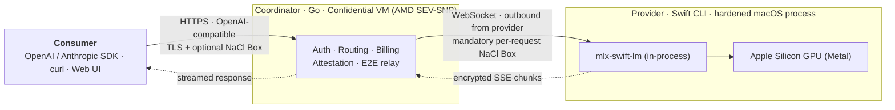
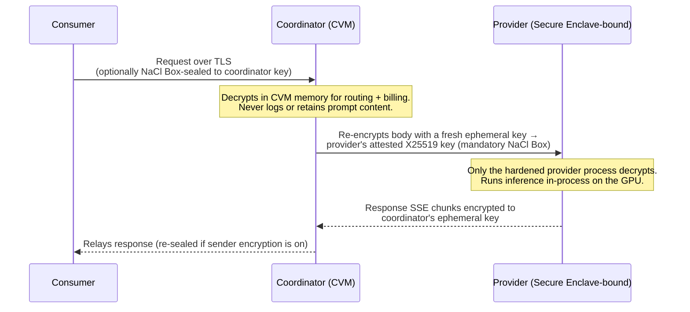
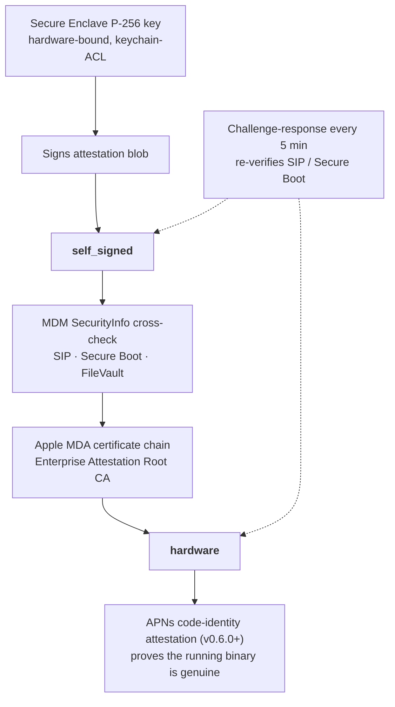

# Darkbloom

> **Public Alpha** — Darkbloom is a decentralized private-inference network for Apple Silicon. Expect rough edges, breaking changes, and downtime. During the alpha, providers keep **100% of revenue** (0% platform fee).

Darkbloom turns idle Macs into a private, OpenAI-compatible inference cloud.

Today, AI compute reaches you through a stack of markups — chipmaker to hyperscaler to API vendor. Meanwhile, over 100 million Apple Silicon Macs sit mostly idle, each with up to 512 GB of unified memory and up to 819 GB/s of bandwidth — enough to run frontier-scale models at interactive speeds. Darkbloom connects that idle capacity directly to demand, and pays the people who own the machines.

The hard part is privacy. The person running a provider node has root and physical custody of the machine doing your inference — yet they must **not** be able to read your prompts or the model's responses. Darkbloom closes every software path to that plaintext:

- **No observation surface.** Inference runs **in-process** via MLX — no subprocess, no local server, no IPC to tap.
- **Locked-down process.** Debuggers are denied at the kernel level (`PT_DENY_ATTACH`); memory-reading APIs are blocked by Hardened Runtime. These protections are immutable for the process lifetime, because removing them requires disabling SIP, which requires a reboot that kills the process.
- **End-to-end encryption.** The coordinator re-seals every request with NaCl Box (X25519 + XSalsa20-Poly1305) to the provider's attested key, so on the provider machine only the hardened process — never its owner — can decrypt it.
- **Hardware attestation.** A four-layer chain — Secure Enclave signatures, MDM cross-checks, Apple Managed Device Attestation, and APNs code-identity — proves each node's security posture and that it runs a genuine, unmodified binary.

What remains is the same residual threat model Apple accepts for Private Cloud Compute: physically de-soldering and probing memory chips. Everything short of that is engineered out.

The API is OpenAI- and Anthropic-compatible, so most clients work by changing one base URL.

---

## Contents

- [How it works](#how-it-works)
- [Privacy & security](#privacy--security)
- [Quickstart (consumers)](#quickstart-consumers)
- [API surface](#api-surface)
- [Models](#models)
- [Pricing](#pricing)
- [Run a provider](#run-a-provider)
- [Self-route & direct mode](#self-route--direct-mode)
- [Repository layout](#repository-layout)
- [Development](#development)
- [Documentation](#documentation)
- [License & disclaimer](#license--disclaimer)

---

## How it works



A consumer calls the coordinator over a standard HTTPS, OpenAI-compatible API. The **coordinator** is a Go control plane running in a Confidential VM; it authenticates the request, picks a provider, handles billing, and relays the encrypted payload. **Providers** are Apple Silicon Macs running the `darkbloom` Swift CLI; they connect *outbound* over WebSocket — **no port forwarding or inbound firewall changes are needed** — decrypt the request inside a hardened process, and run inference in-process on the GPU via MLX.

## Privacy & security

Darkbloom is engineered so that **the operator of the Mac running your inference cannot read your prompt or the response.** The only plaintext exposure anywhere is transient — inside the coordinator's hardware-encrypted Confidential-VM memory — and it is never logged or retained.

### Encryption, hop by hop



| Hop | Protection |
|-----|------------|
| Consumer → Coordinator | TLS by default; **optionally** NaCl Box-sealed to the coordinator's X25519 key (`GET /v1/encryption-key`) |
| Inside Coordinator | Decrypts in Confidential-VM memory for routing & billing only; **never logs or retains prompt content** |
| Coordinator → Provider | **Mandatory** per-request NaCl Box to the provider's attested X25519 key, with a fresh ephemeral key per request |
| Provider → Coordinator | Response chunks encrypted back to the coordinator's ephemeral key |

> **Precise claim:** Darkbloom is not "the coordinator never sees plaintext." The accurate statement is that plaintext is exposed *only* inside the coordinator's hardware-encrypted CVM memory, is never logged or retained, and is immediately re-encrypted for the selected provider. The provider is the final decryption endpoint, and it is bound to an attested Secure Enclave identity. See [`docs/architecture/security/encryption.md`](docs/architecture/security/encryption.md) and [`docs/consumer/privacy-expectations.md`](docs/consumer/privacy-expectations.md).

### Provider hardening

| Layer | What it does |
|-------|--------------|
| In-process inference | MLX runs inside the provider process — no subprocess, local server, or IPC to observe |
| Hardened Runtime + SIP | Blocks debugger attachment, memory reads, and code injection; immutable for the process lifetime |
| `PT_DENY_ATTACH` | Kernel-level denial of debugger attach |
| Hypervisor memory isolation | `Hypervisor.framework` Stage-2 page tables protect inference memory from RDMA/DMA attacks |

### Attestation & trust



Providers carry one of three trust levels, surfaced to consumers on every response via the `X-Provider-Trust-Level` header (alongside `X-Provider-Attested`, `X-Provider-Encrypted`, `X-Provider-Chip`, and `X-Provider-Secure-Enclave`):

| Level | Verification |
|-------|--------------|
| `none` | No attestation — not admitted for private text traffic |
| `self_signed` | Secure Enclave P-256 signature + periodic challenge-response |
| `hardware` | MDM enrollment + Apple Managed Device Attestation (MDA) certificate chain |

The strongest production gate is **APNs code-identity attestation**, which proves the running provider binary is genuine and team-provisioned. The full attestation chain for any provider is publicly verifiable at **`GET /v1/providers/attestation`**.

## Quickstart (consumers)

The API is OpenAI-compatible — point any OpenAI SDK at the Darkbloom base URL.

**Base URL:** `https://api.darkbloom.dev/v1`
**Auth:** `Authorization: Bearer <key>`, where `<key>` is an API key (`sk-db-…`, created in the [console](https://console.darkbloom.dev)) or a Privy session JWT.

```python
from openai import OpenAI

client = OpenAI(
    base_url="https://api.darkbloom.dev/v1",
    api_key="sk-db-...",
)

stream = client.chat.completions.create(
    model="gemma-4-26b",                       # use an id from GET /v1/models
    messages=[{"role": "user", "content": "Hello, Darkbloom!"}],
    stream=True,
)
for chunk in stream:
    if chunk.choices[0].delta.content:
        print(chunk.choices[0].delta.content, end="")
```

```bash
curl https://api.darkbloom.dev/v1/chat/completions \
  -H "Authorization: Bearer sk-db-..." \
  -H "Content-Type: application/json" \
  -d '{"model":"gemma-4-26b","messages":[{"role":"user","content":"Hello!"}],"stream":true}'
```

The **Anthropic Messages API** works too — point the Anthropic SDK at the same base URL and use `/v1/messages`.

See [`docs/consumer/quickstart.md`](docs/consumer/quickstart.md) for authentication, streaming, and SDK details.

## API surface

OpenAI-compatible, with Anthropic Messages support. Inference endpoints require a Bearer key; reads marked *public* need no auth.

| Method & path | Purpose |
|---------------|---------|
| `POST /v1/chat/completions` | OpenAI Chat Completions (streaming + non-streaming) |
| `POST /v1/responses` | OpenAI Responses API (auto-detects `input` vs `messages`) |
| `POST /v1/completions` | OpenAI legacy text completions |
| `POST /v1/messages` | Anthropic Messages API |
| `GET /v1/models` | List models (OpenAI shape) |
| `GET /v1/models/{id}` | Retrieve a model |
| `GET /v1/models/catalog` | *Public* — full model catalog with Darkbloom metadata |
| `GET /v1/pricing` | *Public* — live per-token pricing |
| `GET /v1/encryption-key` | *Public* — coordinator X25519 key for optional sender-side sealing |
| `GET /v1/providers/attestation` | *Public* — provider attestation chains for verification |
| `GET /v1/payments/balance`, `GET /v1/payments/usage` | Account balance and usage |

Supported across the inference endpoints: **streaming (SSE)**, **tool / function calling**, **vision / multimodal** input, **reasoning models**, and server-side **continuous batching** for throughput. `n > 1` is rejected with `400` (on chat completions and the Responses API). Unimplemented OpenAI endpoints (e.g. `/v1/embeddings`) return a structured `404`.

Full request/response schemas: [`docs/reference/api-contracts.md`](docs/reference/api-contracts.md).

## Models

The model catalog is **owned by the coordinator** and DB-backed — there is no hardcoded model list. Consumer-facing names are stable aliases (e.g. `gemma-4-26b`, `gpt-oss-20b`) that resolve to concrete, versioned builds; aliases can be re-pointed to new builds without breaking clients. Providers download approved models from `https://models.darkbloom.ai` and verify per-file and aggregate SHA-256 hashes before serving.

**The authoritative, live list is always [`GET /v1/models`](https://api.darkbloom.dev/v1/models)** (or the public `GET /v1/models/catalog`). Representative current models:

| Alias | Family | Notes |
|-------|--------|-------|
| `gemma-4-26b` | Gemma 4 (MoE, ~4B active) | Google's latest MoE; multimodal (text + vision) |
| `gpt-oss-20b` | GPT-OSS 20B (MoE, ~3.6B active) | OpenAI open-weight reasoning model |

Quantization and exact build details evolve — query `/v1/models` rather than hardcoding them. See [`docs/consumer/models.md`](docs/consumer/models.md).

## Pricing

Pricing is per-token and resolved per request: a provider's custom price, else a platform price, else built-in fallbacks.

| Item | Fallback default |
|------|------------------|
| Input tokens | $0.05 / 1M |
| Output tokens | $0.20 / 1M |
| Minimum charge | $0.0001 / request |
| Platform fee | **0%** during public alpha |

Per-token rates target roughly half of comparable hosted APIs. **Live per-model pricing is always at [`GET /v1/pricing`](https://api.darkbloom.dev/v1/pricing).** Funding is via Solana USDC deposits (verified on-chain) or Stripe; provider payouts run through Stripe Connect. Requests routed to your own machine via [self-route](#self-route--direct-mode) are **free**. See [`docs/reference/pricing-model.md`](docs/reference/pricing-model.md).

## Run a provider

Earn by serving inference on your idle Mac — and stop paying for your own usage via [self-route](#self-route--direct-mode).

### Requirements

| | Minimum | Recommended |
|---|---|---|
| **Chip** | Apple Silicon (M1+) | M1 Pro/Max/Ultra or newer |
| **macOS** | 14 (Sonoma) | Latest stable |
| **Memory** | 8 GB (start is rejected below 8 GB) | 32 GB+ for large or multi-model |
| **Disk** | 50 GB free | 100 GB+ |
| **Network** | Outbound HTTPS (443) | Low-latency path to `api.darkbloom.dev` |

A model loads when it fits in available memory plus a small headroom (`weights + ~2 GB`), after the OS reserve. See [`docs/provider/hardware-requirements.md`](docs/provider/hardware-requirements.md).

### Install

```bash
curl -fsSL https://api.darkbloom.dev/install.sh | bash
```

Zero prerequisites and no `sudo`. The installer fetches the latest signed release, verifies the bundle / binary / `mlx.metallib` SHA-256 against the coordinator's release record, checks the Apple Developer ID code signature, provisions the Secure Enclave helper, and offers to install the MDM enrollment profile for hardware trust. See [`docs/provider/installation.md`](docs/provider/installation.md).

### First run

```bash
darkbloom start              # background launchd service (interactive model picker)
darkbloom start --foreground # run attached to the terminal
darkbloom login              # link your account (RFC 8628 device-code flow)
darkbloom status             # config, hardware, schedule, live trust verdict
darkbloom doctor             # local diagnostics + coordinator's trust view
```

[`docs/provider/quickstart.md`](docs/provider/quickstart.md) walks through the full flow.

### CLI reference

| Command | Purpose |
|---------|---------|
| `start` | Start serving (launchd daemon, `--foreground`, or `--local`) |
| `stop` / `restart` | Stop (`--uninstall` removes the agent) / restart in place |
| `status` | Hardware, config, schedule, and live daemon/trust state |
| `doctor` / `verify` | Diagnostics (`verify` = strict, non-zero on any warning) |
| `models` | `catalog`, `list`, `download`, `remove` cached models |
| `login` / `logout` | Link / unlink the provider to a Darkbloom account |
| `enroll` / `unenroll` | MDM enrollment for hardware-trust attestation |
| `benchmark` | Local tokens/sec benchmark |
| `update` | Check for and apply provider updates |
| `logs` | Tail provider logs |

There is **no** `serve` or `earnings` command — use `start`, and view earnings in the [console](https://console.darkbloom.dev). Full flags: [`docs/provider/cli-reference.md`](docs/provider/cli-reference.md).

### Configuration

Config lives at `~/.config/darkbloom/provider.toml` (created on first start):

```toml
[provider]
name = "darkbloom-mac-1"
memory_reserve_gb = 4
auto_update = true
auto_restart = true

[backend]
enabled_models = []        # empty = advertise all downloaded models
idle_timeout_mins = 60     # unload an idle model after N minutes (0 = never)
max_model_slots = 3        # max models resident at once
continuous_batching = true

[coordinator]
url = "wss://api.darkbloom.dev/ws/provider"
heartbeat_interval_secs = 5
private_only = false       # true = serve only your own self-route traffic

# Optional availability windows — outside them the node disconnects and frees GPU memory
[schedule]
enabled = true             # windows only take effect when this is true

[[schedule.windows]]
days  = ["mon", "tue", "wed", "thu", "fri"]
start = "22:00"
end   = "08:00"
```

## Self-route & direct mode

Running a node also makes your **own** inference free.

- **Self-route** — *"use my own machine, for free."* Add `X-Darkbloom-Route: self` to any request to route **only** to a provider your account owns: free, end-to-end encrypted, with no fallback to the paid fleet (you get an explicit error if your machine can't serve). `X-Darkbloom-Route: prefer` routes to your machine first but falls back to the paid fleet so you're never stuck. An API key can also be pinned to owned-only with `self_route_only`. See [`docs/provider/self-route.md`](docs/provider/self-route.md).

- **Direct mode** — when the client can reach your Mac (same machine / LAN / tailnet), `darkbloom start --local` serves an OpenAI-compatible endpoint locally and **skips the coordinator entirely**: lowest latency, offline-capable, bytes never leave your network. See [`docs/provider/direct-mode.md`](docs/provider/direct-mode.md).

## Repository layout

| Path | Language | Role |
|------|----------|------|
| `coordinator/` | Go | Control plane: OpenAI/Anthropic API, routing, attestation, billing, model registry |
| `provider-swift/` | Swift | `darkbloom` provider CLI for Apple Silicon (in-process MLX inference) |
| `console-ui/` | Next.js 16 / React 19 | Web dashboard: chat, billing, models, provider verification |
| `landing/` | Static HTML | Marketing landing page |
| `e2e/` | Go | System-level end-to-end & load test harness |
| `scripts/` | Shell | Installer, admin CLI, model publishing, deploy helpers |
| `docs/` | Markdown | Architecture, security, operations, and reference docs |

The coordinator and provider share WebSocket message types that must stay in sync (`coordinator/protocol/` ↔ `provider-swift/Sources/ProviderCore/Protocol/`).

## Development

```bash
# Coordinator (Go)
cd coordinator && go test ./...
GOOS=linux GOARCH=amd64 CGO_ENABLED=0 go build -o coordinator-linux ./cmd/coordinator   # container build

# Provider (Swift) — depends on libs/mlx-swift and libs/mlx-swift-lm submodules
cd provider-swift && swift test
cd provider-swift && swift build -c release      # → .build/release/darkbloom

# Console UI (Next.js 16)
cd console-ui && npm install && npm run dev
cd console-ui && npm run build && npm test       # production build + vitest
```

Build, test, and release details: [`docs/developer/build.md`](docs/developer/build.md), [`docs/developer/test.md`](docs/developer/test.md), [`docs/developer/release.md`](docs/developer/release.md).

## Documentation

Full technical docs live in [`docs/`](docs/README.md). Starting points:

| You want to… | Start here |
|---|---|
| Call the API | [`docs/consumer/quickstart.md`](docs/consumer/quickstart.md) |
| Understand the system | [`docs/architecture/overview.md`](docs/architecture/overview.md) |
| Understand the privacy model | [`docs/architecture/security/encryption.md`](docs/architecture/security/encryption.md) |
| Run a provider node | [`docs/provider/installation.md`](docs/provider/installation.md) → [`docs/provider/quickstart.md`](docs/provider/quickstart.md) |
| Verify a provider's attestation | [`docs/consumer/verification.md`](docs/consumer/verification.md) |
| Build or contribute | [`docs/developer/build.md`](docs/developer/build.md) |

## License & disclaimer

Proprietary. All rights reserved.

> 🚧 Darkbloom is under active development and has not been audited. It is upgraded rapidly; features may be added, removed, or changed, and interfaces will have breaking changes. Use it for testing only, not in production. Darkbloom is provided "as is" and Eigen Labs, Inc. does not guarantee its functionality or provide production support. 🚧

**Security bugs:** report vulnerabilities to **security@eigenlabs.org** — *not* via GitHub Issues.
