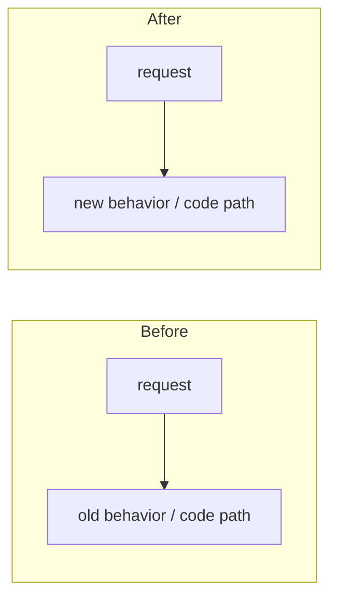

# Darkbloom Documentation — Agent Guidelines

This directory contains the public technical documentation for Darkbloom. Treat the code as the source of truth; docs are wrong if they disagree with the code.

## Directory roles

| Directory | Purpose | Audience |
|---|---|---|
| `consumer/` | How to use the OpenAI-compatible API | API consumers |
| `provider/` | How to run a provider node | Node operators |
| `developer/` | How to build, test, and release | Contributors |
| `architecture/` | System architecture — **source of truth** | Anyone who wants to understand how it works |
| `operations/` | Deployment, migration, and incident runbooks | Operators |
| `reference/` | Contracts, schemas, and specs | All audiences |
| `legal/` | Privacy policy and terms of service | Legal / users |
| `assets/` | Shared images, CSVs, diagrams | All docs |
| `.private/` | Internal/marketing drafts | Not public docs |

## Rules

1. **Code wins.** If a doc contradicts the code, update the doc. Quote canonical file paths and line numbers when describing behavior.
2. **Architecture docs must cite code.** Every claim about behavior should reference a file in `coordinator/`, `provider-swift/`, `console-ui/`, or `e2e/`.
3. **Do not copy marketing language.** Phrases like "the coordinator never sees plaintext prompts" are inaccurate; use the precise hop-by-hop model from `architecture/security/encryption.md`.
4. **Keep outdated docs out.** When moving content, delete the old file; do not leave stale copies behind.
5. **Cross-reference with relative paths.** Use `../security/encryption.md` style links, not absolute paths.
6. **One concern per file.** If a file mixes several concerns, split it.
7. **Runbooks are procedural.** Each `operations/` doc should have Prerequisites, Steps, Verification, and Rollback sections.
8. **Reference docs are dry.** `reference/` docs should be tables, schemas, and contracts — minimal narrative.

## Pull Requests

**Every PR MUST include a before-and-after diagram (Mermaid) in its description** that details what changed — covering BOTH:

- **Behavior**: the request/response flow, states, and outcomes a user or caller observes (e.g. dispatch → retry → 429/503/200).
- **Code**: which functions/components changed and how control flows through them.

Use two clearly labeled diagrams — a **Before** and an **After** — (or one side-by-side comparison) so a reviewer sees the delta at a glance. Scope it to what the PR changes; it is not a full-system map. A PR without a before/after diagram is not ready for review.

````markdown

````

## Privacy model (canonical)

- Consumer → coordinator: TLS by default; optional NaCl Box (X25519 + XSalsa20-Poly1305).
- Coordinator → provider: mandatory per-request NaCl Box to the provider's attested X25519 public key.
- Provider → coordinator: response SSE chunks encrypted back to the coordinator's ephemeral X25519 key.
- The coordinator decrypts consumer bodies in its Confidential VM memory for routing and billing, but does not log or retain prompt content.
- The provider is the decryption endpoint for prompts; it is bound to Apple Secure Enclave identity and code-identity attestation.

## Key canonical code paths

| Concern | Code path |
|---|---|
| Consumer→coord encryption | `coordinator/api/sender_encryption.go` |
| Coord→provider encryption | `coordinator/internal/e2e/e2e.go`, `coordinator/api/consumer.go:448-510` |
| Provider decryption / response encryption | `provider-swift/Sources/ProviderCore/ProviderLoop.swift:890-` (`handleInferenceRequest`) |
| Attestation verification | `coordinator/attestation/attestation.go`, `coordinator/api/provider.go:2078` |
| Trust levels / routing gates | `coordinator/registry/registry.go:providerSupportsPrivateTextLocked` |
| APNs code identity | `coordinator/apns/attestor.go`, `coordinator/api/provider.go:487-617` |
| Billing / pricing | `coordinator/payments/pricing.go`, `coordinator/api/provider.go:1640-1944` |
| Routing / scheduling | `coordinator/registry/scheduler.go` |
