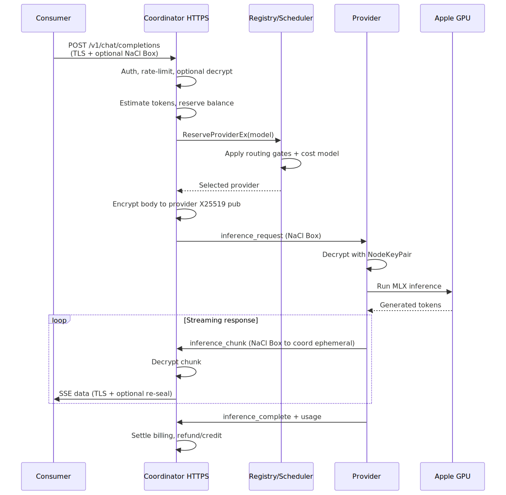

# Darkbloom Request Data Flow



This document walks through the lifecycle of a single inference request, from the consumer HTTP call to the provider response and final billing settlement. Every behavioral claim is pinned to a canonical code path.

## 1. Consumer Request

The consumer sends a request to the coordinator over HTTPS. The canonical entry point is `POST /v1/chat/completions` (`coordinator/api/server.go:1411`).

### Optional sender sealing

If the request carries `Content-Type: application/eigeninference-sealed+json`, the `sealedTransport` middleware decrypts it before the handler sees plaintext and seals the response on the way out (`coordinator/api/sender_encryption.go:119-200`). The coordinator's long-lived X25519 public key is published at `GET /v1/encryption-key` (`coordinator/api/sender_encryption.go:93-111`).

When sender sealing is **not** used, the request body is plaintext TLS to the coordinator. In both cases the coordinator ends up with the plaintext JSON body inside its CVM memory.

## 2. Authentication, Rate Limit, and Preflight

The route stack is (`coordinator/api/server.go:1411`):

```go
s.mux.HandleFunc("POST /v1/chat/completions",
    s.requireAuth(s.rateLimitConsumer(s.sealedTransport(s.handleChatCompletions))))
```

1. `requireAuth` validates the API key or Privy JWT.
2. `rateLimitConsumer` applies per-key/account rate limits.
3. `sealedTransport` conditionally decrypts/encrypts.
4. `handleChatCompletions` parses the request, estimates tokens, reserves balance, and dispatches.

Before dispatch, the handler:

* Estimates prompt tokens with a `len/4` heuristic for routing and queue admission (`coordinator/api/consumer.go:535-553`).
* Reserves an up-front balance amount based on the requested `max_tokens` and resolved pricing (`coordinator/api/consumer.go` reservation path).
* Runs `QuickCapacityCheck` to decide whether to return `404`/`503` (no provider serves the model) or `429` (providers exist but are at capacity) (`coordinator/registry/scheduler.go:1079-1155`).

## 3. Provider Selection

The production dispatch hot path calls `Registry.ReserveProviderEx` (`coordinator/registry/scheduler.go:213-292`). The candidate cost is the sum of (`coordinator/registry/scheduler.go:802-894`):

| Term | Meaning |
|---|---|
| `StateMs` | Slot-state penalty: `running`/`idle` = 0, `unknown` = 30 s, `idle_shutdown` = 20 s |
| `QueueMs` | `effectiveQueue × queueDepthPenaltyMs` (3 s) |
| `PendingMs` | `totalPending × totalPendingPenaltyMs` (0.75 s) |
| `BacklogMs` | Tokens already committed / effective decode TPS |
| `ThisReqMs` | `promptTokens/prefillTPS + maxTokens/effectiveTPS` |
| `HealthMs` | Memory pressure, CPU, thermal, GPU utilization |

Selection is deterministic lowest-cost, with queue-depth and random tie-breaks for near-ties (`coordinator/registry/scheduler.go:421-459`).

Routing gates applied to every candidate (`coordinator/registry/scheduler.go:598-648`):

1. Catalog membership (`providerServesCatalogModelLocked`).
2. Dispatch-load cooldown (recent "insufficient memory" for this provider+model).
3. Shape-keyed inference-error cooldown (repeated 5xx for this request shape).
4. Status not `offline`/`untrusted`.
5. Private-only machines excluded from public fleet unless owner self-route.
6. Trust floor (`MinTrustLevel`), relaxed only for the owner's own machine.
7. Runtime verified.
8. Private-text support (`providerSupportsPrivateTextLocked`).
9. Challenge freshness (within 6 minutes).
10. Trait eligibility (render-broken fences, tools version floor).

## 4. Coordinator → Provider Encryption

Once a provider is selected, the coordinator re-encrypts the raw request body to the provider's attested X25519 public key (`coordinator/api/consumer.go:448-510`):

1. Generates an ephemeral X25519 key pair (`e2e.GenerateSessionKeys`).
2. Encrypts with NaCl Box (`e2e.Encrypt` in `coordinator/internal/e2e/e2e.go:62-82`).
3. Sends a WebSocket text message of type `inference_request` containing the ephemeral public key and ciphertext.

The provider's public key was bound to its Secure Enclave identity at registration (`coordinator/api/provider.go:2130-2156`).

## 5. Provider Processing

The provider receives the `inference_request` over its outbound WebSocket, decrypts the body with its private X25519 key, runs inference in-process via MLX-Swift, and streams response chunks. Each SSE chunk is encrypted back to the coordinator's ephemeral X25519 key (`provider-swift/Sources/ProviderCore/ProviderLoop.swift:959-1178`).

Key provider-side behavior:

* Model loading is on-demand. The provider can hold up to `maxModelSlots` models (default 3) and evicts idle models LRU-style (`coordinator/registry/scheduler.go:765-768`).
* The provider-side load gate requires `weights_gb + 2.0` GB of headroom after the OS reserve and in-flight KV reservations, which is stricter than the coordinator's admission gate (`provider-swift/Sources/ProviderCore/Inference/ModelLoadAdmission.swift:19-24`).
* If the model is not resident, the provider loads it; the coordinator waits up to the TTFT deadline (5 s + 1 ms per input token) and can start a speculative backup dispatch at 50% of the deadline (`coordinator/api/consumer.go:72-76`, `ttftDeadline`).

## 6. Response Relay to Consumer

The coordinator's provider read loop receives encrypted chunks, decrypts them with the ephemeral private key, and forwards them to the consumer response goroutine, which streams SSE (`chunkBufferSize = 256`, `coordinator/api/consumer.go:64`).

If the consumer disconnects, the coordinator sends a `cancel` message to the provider with a bounded write timeout (`coordinator/api/consumer.go:103-126`).

## 7. Completion and Billing Settlement

When the provider sends an `inference_complete` message, the coordinator settles billing (`coordinator/api/provider.go:1640-1944`):

1. Records job success and clears any dispatch-load cooldown.
2. Resolves pricing:
   * Provider custom price → platform admin price → fallback defaults.
   * Service/wholesale consumers (e.g., OpenRouter) use the platform price, no provider custom markup, and no per-request minimum.
3. Computes total cost from reported prompt and completion tokens (`payments.CalculateCostWithOverrides` or `CalculateCostWithOverridesNoMinimum`, `coordinator/payments/pricing.go:62-120`).
4. Applies the platform fee override (global default is 0% during alpha).
5. Self-route / prefer-owner logic: if an owned machine served the request, cost and payout are zeroed; otherwise normal paid settlement applies.
6. Settles against the pre-flight reservation:
   * If actual cost > reservation, charges overage (capped at 1× reservation).
   * If actual cost < reservation, refunds the difference.
7. Credits the provider's linked account and credits any platform fee to the platform account.
8. Persists usage asynchronously, except for free self-route traffic which is excluded from public stats.

## 8. Attestation Challenge Interleaved

Independently of inference traffic, the coordinator runs a periodic challenge-response loop for each provider (`coordinator/api/provider.go:818-920`):

1. Initial challenge sent immediately after registration.
2. Then every `DefaultChallengeInterval` (5 minutes).
3. Provider signs `nonce + timestamp` with its SE P-256 key.
4. Coordinator verifies signature, public key match, and fresh SIP/Secure Boot status.
5. Disabled SIP or Secure Boot → immediate untrust; three consecutive transient failures → untrust.

The APNs code-identity attestation loop runs once per connection (not periodically) and proves the running binary's code identity via a push challenge round-trip (`coordinator/api/provider.go:487-617`).

## Trust Boundaries

| Boundary | What is trusted | What is NOT trusted |
|---|---|---|
| Consumer → coordinator | TLS certificate chain; optional NaCl Box to coordinator pubkey | Provider cannot read this hop |
| Coordinator CVM | Hardware-encrypted memory; code is the audited coordinator binary | Cloud provider cannot read CVM memory (SEV-SNP) |
| Coordinator → provider | NaCl Box to provider's attested X25519 pubkey | Provider network cannot read ciphertext |
| Provider process | Hardened Runtime, PT_DENY_ATTACH, in-process inference, SIP | Provider owner cannot inspect process memory or attach a debugger |

The coordinator decrypts in CVM memory for routing and billing but does not log or retain prompt content. The provider is the final decryption endpoint and is bound to Apple Secure Enclave identity plus code-identity attestation.
