# APNs-based provider code-identity attestation

**Status:** Implemented (v0.6.0)

## Context

In a permissionless network, the coordinator must be able to tell that a provider is running the genuine Darkbloom binary, not a fork that logs prompts. The existing attestation stack proves the device and SIP state via the Apple Mobile Device Attestation (MDA) flow, but it does **not** prove which binary is running. A self-reported `binaryHash` cannot prove code identity, because the measurer is the potentially-malicious provider.

The canonical privacy model is unchanged by this decision: consumer→coordinator traffic is TLS plus optional NaCl Box; coordinator→provider traffic is a mandatory per-request NaCl Box to the provider's attested X25519 key; the coordinator decrypts bodies only inside the CVM for routing and billing and does not log or retain prompt content; the provider remains the decryption endpoint. See `../../AGENTS.md` §Privacy model.

## Decision

Add an APNs-delivered code-identity challenge that is bound to the provider's WebSocket connection.

1. **Apple-gated channel.** Only a process that (a) is signed with our Developer ID, (b) carries our globally-unique App ID `io.darkbloom.provider`, and (c) is authorized by an Apple-signed provisioning profile with the `aps-environment` entitlement can receive a push for our topic. The `AppleMobileFileIntegrity.kext` kernel extension (AMFI) enforces code signature, entitlements, and provisioning-profile validity at launch, so a modified or re-signed binary cannot register for our push topic.
2. **Encrypted challenge.** The coordinator pushes `E_K(nonce)` — a nonce encrypted to the provider's registered X25519 public key `K` using the same inference E2E path. `K` is decrypt-only and lives in the provider's protected process memory.
3. **WebSocket reply.** The provider decrypts the nonce with `K` and returns the recovered nonce plus a Secure-Enclave P-256 signature over it (`Sign_SE(nonce)`). The coordinator verifies both the nonce and the signature against the SE public key bound at registration.
4. **Per-connection state.** `CodeAttested` is in-memory only, reset on disconnect. A SIP downgrade requires reboot, which drops the WebSocket and forces re-attestation.
5. **Routing gate.** Private text traffic is gated at the single chokepoint `providerSupportsPrivateTextLocked`. Enforcement is live-configurable via a grace deadline so the fleet can roll out without a hard cutover.
6. **APNs mode.** The sender is dual-mode: `background` (default, silent, ~2–3/hour device budget) and `alert` (priority 10, reliable but visible). Alert mode is safe only because the provider never requests `UNUserNotificationCenter` authorization, so the alert is not persisted to the Notification Center DB.
7. **MDM remains required.** The only working, non-circular SIP/Secure-Boot proof is the Apple-signed MDA obtained via MDM. ACME `device-attest-01` does not currently carry or verify the SIP OID, so slimming enrollment is out of scope.



```mermaid
sequenceDiagram
    participant P as Provider (genuine binary)
    participant A as APNs
    participant C as Coordinator
    P->>A: registerForRemoteNotifications()
    A-->>P: device token T
    P->>C: WS register {K, T, SE pubkey}
    C->>A: POST /3/device/T payload E_K(nonce)
    A-->>P: silent push with code_challenge
    P->>P: decrypt nonce with K; Sign_SE(nonce)
    P->>C: WS code_attestation_response {nonce, signature}
    C->>C: verify nonce + SE signature
    C->>C: CodeAttested = true
```

## Consequences

| Positive | Negative / Risk |
|---|---|
| Remotely-verifiable, non-self-reportable code identity with ~0 inference overhead. | Background push delivery is best-effort and budget-throttled; unreliable delivery would require switching to alert mode. |
| No human allowlist required. | Requires an Apple-signed push provisioning profile, `.p8` auth key, and CI assertions that the signed binary has no `get-task-allow`. |
| Fail-closed: un-attested providers are simply not routed private traffic. | Requires a logged-in macOS GUI session; headless/login-screen providers cannot receive APNs and will be derouted once enforcement begins. |
| Continuous binding after attestation because every request is encrypted to `K`. | Does not prove exact cdhash/version; that gap is closed by reproducible builds + a transparency log of blessed hashes. |

## Relevant code paths

| Concern | Code path |
|---|---|
| APNs challenge builder + dual-mode sender | `coordinator/apns/attestor.go:78-328` (`CodeIdentityAttestor`, `APNsPushAttestor.SendCodeChallenge`, `BuildCodeChallengePayload`) |
| APNs mode / JWT lifetime / expiry constants | `coordinator/apns/attestor.go:53-68` |
| Provider registration stores token & starts attestation | `coordinator/api/provider.go:220-372` |
| Per-connection attestation loop | `coordinator/api/provider.go:487-542` (`codeAttestLoop`) |
| Challenge send + response verification | `coordinator/api/provider.go:544-617` (`sendCodeIdentityChallenge`) |
| Routing chokepoint | `coordinator/registry/registry.go:311-328` (`providerSupportsPrivateTextLocked`) |
| Code-attestation rollout state | `coordinator/registry/registry.go:486-490` (`codeAttestationEnforcedLocked`) |
| Provider struct fields | `coordinator/registry/registry.go:238-299` (`APNsDeviceToken`, `CodeAttested`) |
| Wire messages | `coordinator/protocol/messages.go:42,159-160,476` |
| SE signature verification | `coordinator/attestation/attestation.go:491` (`VerifyChallengeSignature`) |
| AppKit host / APNs delegate / no notification auth invariant | `provider-swift/Sources/darkbloom/ProviderAppKitHost.swift:52-91` |
| Device-token bridge + early-push buffering | `provider-swift/Sources/ProviderCore/Apns/APNsBridge.swift:12-79` |
| Provider awaits token, installs push handler | `provider-swift/Sources/ProviderCore/ProviderLoop.swift:574-644` |
| Decrypt + sign challenge | `provider-swift/Sources/ProviderCore/ProviderLoop.swift:3116-3156` |
| Liveness/status challenge (unchanged) | `provider-swift/Sources/ProviderCore/ProviderLoop.swift:3043-3107` |
| Push entitlement | `provider-swift/entitlements.plist:11-12` |
