# Routing

Darkbloom's production dispatch path is a **cost-minimization scheduler**. For each inference request it builds every eligible provider into a candidate, computes an estimated completion time (in milliseconds), and selects the lowest-cost candidate.

The canonical implementation is `Registry.ReserveProviderEx` in `coordinator/registry/scheduler.go:213-292`.



The flow above maps to the consumer handler in `coordinator/api/consumer.go`: auth and rate-limit, optional sender-seal (`coordinator/api/sender_encryption.go`), NaCl Box decryption (`consumer.go:448-510`), token estimation and balance reservation, then a `QuickCapacityCheck` (`scheduler.go:1079-1193`) before `ReserveProviderEx` selects a provider. The chosen request is re-encrypted with a fresh per-request NaCl Box to the provider's attested X25519 key and dispatched over the provider WebSocket as an `inference_request`.

## Privacy boundary

Routing decisions are made after the coordinator has decrypted the request body:

* **Consumer → coordinator**: TLS by default; optional NaCl Box (`coordinator/api/sender_encryption.go`).
* **Coordinator → provider**: mandatory per-request NaCl Box to the provider's attested X25519 public key (`coordinator/api/consumer.go:448-510`, `coordinator/internal/e2e/e2e.go`).
* The coordinator decrypts bodies in Confidential-VM memory for routing and billing, but does **not** log or retain prompt content.
* The provider is the decryption endpoint for prompts.

See the canonical privacy model in [`../../AGENTS.md`](../../AGENTS.md) and the overview in [`../overview.md`](../overview.md).

## Entry point

```go
func (r *Registry) ReserveProviderEx(
    model string,
    pr *PendingRequest,
    excludeIDs ...string,
) (*Provider, RoutingDecision)
```

`ReserveProviderEx` is the only production path that both selects a provider and atomically reserves capacity. It returns a `RoutingDecision` (`scheduler.go:172-197`) so callers can emit metrics without reaching into registry internals.

The public wrapper `ReserveProvider` (`scheduler.go:199-205`) discards the decision and is used by tests and legacy callers.

## Candidate selection and reservation

`selectBestCandidateLockedFull` (`scheduler.go:302-462`) first collects every provider that passes the structural gates, then scores each one with `buildCandidateWithReason`. It returns the winner plus rejection counters:

| Counter | Meaning |
|---|---|
| `CandidateCount` | Providers that passed every gate and could route right now |
| `CapacityRejections` | Providers rejected for transient capacity/memory pressure (retryable) |
| `ModelTooLargeRejections` | Providers whose memory can never fit the model (permanent) |
| `VisionRejections` | Providers that serve the model only as a text-only build when vision is required |

The lowest-cost candidate wins. Candidates within `nearTieCostWindowMs` (`3_000` ms) of the best are considered tied (`scheduler.go:427-432`); ties are broken by lowest `effectiveQueue`, then lowest `totalPending`, then uniform random choice (`scheduler.go:448-458`).

After selection, `ReserveProviderEx` re-takes the provider lock and runs `providerCanAdmitLocked` (`scheduler.go:1029-1050`) to re-apply the routing gates and capacity/slot-state checks. If the provider's state changed between snapshot and reservation, the selection is rejected and the caller may retry.

## Structural gates

Before a provider becomes a candidate it must pass `providerPassesRoutingGatesLocked` (`scheduler.go:598-648`). Gates are evaluated in this order:

1. Catalog membership — advertises an allowed build of the model (`providerServesCatalogModelLocked`).
2. Dispatch-load cooldown — skip a provider-model pair that recently failed to load with "insufficient memory" (`dispatchLoadCooldownActiveLocked`).
3. Inference-error cooldown — shape-keyed circuit breaker for repeated provider-side 5xx failures (`inferenceErrorCooldownActiveLocked`, keyed by `traits.CooldownShape()`).
4. Status not `offline`/`untrusted`.
5. Private-only admission — a `PrivateOnly` machine serves only its owner's self-route traffic.
6. Hardware-trust floor — public traffic must meet `r.MinTrustLevel`; self-route to an owned machine relaxes this to `TrustNone`.
7. Runtime verified (`RuntimeVerified == true`).
8. Private-text support (`providerSupportsPrivateTextLocked`).
9. Challenge freshness — `LastChallengeVerified` within `challengeFreshnessMaxAge` (6 minutes).
10. Trait eligibility — `template_render_ok=false` fences every shape; capability version floors are trait-scoped (tools-only today).

The same gate set is used by `QuickCapacityCheck` (`scheduler.go:1079-1193`) so preflight capacity reports never drift from actual dispatch behavior.

## Cost function

`buildCandidateWithReason` (`scheduler.go:802-894`) computes the per-candidate cost:

```text
costMs = statePenalty
       + (effectiveQueue × queueDepthPenaltyMs)
       + (totalPending × totalPendingPenaltyMs)
       + backlogMs
       + thisReqMs
       + healthPenaltyMs
```

Each term maps to a field in `RoutingDecision`:

| Term | Field | Value / source |
|---|---|---|
| Slot-state penalty | `StateMs` | `0` for `running`/`idle`, `30_000` for `unknown`, `20_000` for `idle_shutdown`, `+Inf` (ineligible) for `crashed`/`reloading` |
| Queue depth | `QueueMs` | `effectiveQueue × queueDepthPenaltyMs` (`3_000` ms) |
| Total pending | `PendingMs` | `totalPending × totalPendingPenaltyMs` (`750` ms) |
| Backlog time | `BacklogMs` | Tokens ahead / effective decode TPS × 1000 |
| This request | `ThisReqMs` | `promptTokens/prefillTPS + maxTokens/effectiveTPS` |
| Health | `HealthMs` | Memory pressure, CPU usage, thermal state, GPU utilization |

Penalty constants are defined at `scheduler.go:16-36`.

### Effective decode TPS

`resolveEffectiveTPS` (`scheduler.go:950-958`) chooses the best available decode estimate in this order:

1. Provider-reported observed EWMA (`slot.ObservedDecodeTPS`).
2. Fleet median TPS for the same model and chip family (`tpsRegistry.Median`).
3. Load-scaled benchmark TPS (`effectiveDecodeTPS`, `scheduler.go:971-983`).

The load-scaled fallback divides the static benchmark TPS by `1 + effectiveTPSLoadFactor × backendRunning`, with `effectiveTPSLoadFactor = 0.27` (`scheduler.go:64`).

## Slot states and penalties

`slotStatePenalty` (`scheduler.go:896-914`) maps the backend-reported slot state:

| State | Penalty | Eligible |
|---|---|---|
| `running` | `0` ms | yes |
| `idle` | `0` ms | yes |
| `unknown` (not loaded) | `30_000` ms | yes |
| `idle_shutdown` | `20_000` ms | yes |
| `reloading` | `+Inf` | no |
| `crashed` | `+Inf` | no |
| any other value | `30_000` ms | yes |

A model is considered **resident** when the slot state is `running` or `idle`; only resident models skip the absolute hardware-fit gate in `buildCandidateWithReason` (`scheduler.go:839-842`).

## Special routing modes

* **Self-route** (`pr.SelfRouteOnly`) — restricted to providers owned by the caller; never falls back to the public fleet (`scheduler.go:325-329`). Trust floor and private-only admission are relaxed for the owner's own machine (`scheduler.go:341`, `scheduler.go:598-648`).
* **Prefer-owner** (`pr.PreferOwner`) — first tries owned candidates, then falls back to the public fleet (`scheduler.go:391-401`). Settlement is free only when the selected provider is owned by the caller (`coordinator/api/provider.go:1706-1733`).
* **Allowed serials** (`pr.AllowedProviderSerials`) — restricts candidates to providers whose attested serial number is in the allowlist (`scheduler.go:307-334`, `providerMatchesAllowedSerial` at `scheduler.go:464-481`).
* **Version-diverse retry** (`Traits.AvoidVersion`) — soft hint that prefers a different binary version after a failure, but never fails closed (`scheduler.go:409-419`).

## Metrics and observability

`logRoutingDecision` (`scheduler.go:551-571`) emits a structured debug record with every cost term. Callers also emit Datadog histograms such as `routing.cost_ms` (`coordinator/api/consumer.go:4158`).
