# Darkbloom Architecture Overview

Darkbloom is a decentralized private-inference network for Apple Silicon Macs.
Consumers call an OpenAI-compatible HTTP API; the coordinator authenticates,
routes, bills, and attests; providers run MLX-based inference locally on macOS.
Prompt content is encrypted end-to-end: the coordinator only handles plaintext
inside its Confidential-VM memory for routing and billing, and does not log or
retain prompt content.

## System diagram

The diagram shows the request flow. Canonical code paths for each hop:

- Consumer → coordinator HTTPS and optional NaCl Box: `coordinator/api/server.go:1411`, `coordinator/api/sender_encryption.go`.
- Coordinator → provider dispatch and mandatory per-request NaCl Box: `coordinator/api/consumer.go:448-510`, `coordinator/internal/e2e/e2e.go`.
- Provider decryption, in-process MLX inference, and response encryption: `provider-swift/Sources/ProviderCore/ProviderLoop.swift:959-1178`.
- Provider attestation and APNs code-identity: `coordinator/api/provider.go:2074-2196`, `coordinator/apns/attestor.go`.

See [`security/encryption.md`](security/encryption.md) for the precise hop-by-hop privacy model.

## Components

| Component | Path | Details |
|---|---|---|
| Coordinator | `coordinator/` | [`components/coordinator.md`](components/coordinator.md) |
| Provider CLI | `provider-swift/` | [`components/provider.md`](components/provider.md) |
| Console UI | `console-ui/` | [`components/console-ui.md`](components/console-ui.md) |
| E2E harness | `e2e/` | `e2e/testbed/` |

### Coordinator

The coordinator is the Go control plane. In production it runs in a
Confidential VM (AMD SEV-SNP) on EigenCloud; development runs on a standard GCP
VM. Route wiring lives in `coordinator/api/server.go:1411-1536`. Key
responsibilities:

* OpenAI-compatible consumer API (`/v1/chat/completions`, `/v1/completions`,
  `/v1/messages`, `/v1/models`, …) — `coordinator/api/consumer.go`.
* Provider WebSocket lifecycle, registration, heartbeats, attestation
  challenges, and APNs code-identity round-trip —
  `coordinator/api/provider.go`.
* Provider registry and cost-based scheduler —
  `coordinator/registry/scheduler.go`, `coordinator/registry/registry.go`.
* Secure Enclave attestation verification —
  `coordinator/attestation/attestation.go`.
* Optional sender→coordinator NaCl Box sealing —
  `coordinator/api/sender_encryption.go`.
* Mandatory per-request coordinator→provider NaCl Box —
  `coordinator/internal/e2e/e2e.go`, `coordinator/api/consumer.go:448-510`.
* Billing, pricing, and ledger settlement —
  `coordinator/payments/pricing.go`, `coordinator/api/provider.go:1640-1944`.

### Provider

The provider is a Swift CLI (`darkbloom`) that runs on Apple Silicon Macs.
Inference is in-process via `mlx-swift-lm` (forked under `libs/mlx-swift-lm`).
There is **no Rust provider**, no embedded Python interpreter, and no local
inference server. The only routable backend is `BackendMLXSwift`
(`coordinator/registry/registry.go:344-348`).

Key subsystems:

* WebSocket client and inference loop —
  `provider-swift/Sources/ProviderCore/ProviderLoop.swift`.
* Prompt decryption and response encryption —
  `provider-swift/Sources/ProviderCore/ProviderLoop.swift:959-1178`.
* Secure Enclave attestation and signing —
  `provider-swift/Sources/darkbloom-enclave-cli/`.
* Model manifests, download, and publish —
  `provider-swift/Sources/ProviderCoreFoundation/`,
  `provider-swift/Sources/darkbloom-publish/`.
* In-process MLX inference — `provider-swift/Sources/ProviderCore/Inference/`.

### Consumer

Consumers use any OpenAI-compatible client pointed at the coordinator. The
consumer HTTP path is wrapped as
`requireAuth → rateLimitConsumer → sealedTransport → handleChatCompletions`
(`coordinator/api/server.go:1411`). Responses include Darkbloom-specific fields
`provider_attested` and `provider_trust_level`.

## Privacy model

The canonical hop-by-hop model is defined in
[`security/encryption.md`](security/encryption.md). In short:

* **Consumer → coordinator**: TLS by default; optional NaCl Box
  (X25519 + XSalsa20-Poly1305) via
  `Content-Type: application/eigeninference-sealed+json`. Key advertisement at
  `GET /v1/encryption-key` (`coordinator/api/sender_encryption.go:93-111`).
* **Coordinator → provider**: mandatory per-request NaCl Box to the provider's
  attested X25519 public key (`coordinator/api/consumer.go:448-510`,
  `coordinator/internal/e2e/e2e.go`).
* **Provider → coordinator**: response SSE chunks encrypted back to the
  coordinator's ephemeral X25519 key
  (`provider-swift/Sources/ProviderCore/ProviderLoop.swift:959-1178`).
* **Coordinator handling**: the coordinator decrypts consumer bodies inside its
  Confidential-VM memory for routing and billing. It does **not** log or retain
  prompt content.
* **Provider endpoint**: the provider is the decryption endpoint for prompts; it
  is bound to Apple Secure Enclave identity and code-identity attestation.

The precise statement is therefore not "the coordinator never sees plaintext
prompts" but "plaintext is exposed only inside the coordinator's CVM memory,
is not logged or retained, and is immediately re-encrypted for the selected
provider."

## Trust levels and attestation

Providers are classified into three attestation levels
(`coordinator/registry/registry.go:51-58`):

| Level | Value | Meaning |
|---|---|---|
| `none` | `"none"` | No attestation provided (Open Mode). Not admitted for private text traffic. |
| `self_signed` | `"self_signed"` | Secure Enclave P-256 ECDSA signature over a hardware/identity blob. |
| `hardware` | `"hardware"` | SE key bound to an Apple MDM Managed Device Attestation (MDA) certificate chain, optionally verified via ACME device-attest-01 client certificates. |

Attestation is verified at registration (`coordinator/api/provider.go:2074-2196`;
`coordinator/attestation/attestation.go:119-231`) and re-verified through
periodic challenge-response: immediately on registration, then every
`DefaultChallengeInterval` (5 minutes)
(`coordinator/api/provider.go:818-920`). Disabled SIP or Secure Boot in a
challenge response marks the provider untrusted immediately.

The strongest production gate is APNs code-identity attestation (v0.6.0+), which
proves the running provider binary is genuine and team-provisioned. See
[`decisions/apns-code-attestation.md`](decisions/apns-code-attestation.md) and
[`security/attestation.md`](security/attestation.md).

## Routing and scheduling

Production routing is a **cost-minimization scheduler**, not round-robin. The
dispatch hot path is `Registry.ReserveProviderEx`
(`coordinator/registry/scheduler.go:213-292`); the full algorithm is documented
in [`operations/routing.md`](operations/routing.md).

The scheduler (`coordinator/registry/scheduler.go:302-462`):

1. Collects every provider that passes structural gates (catalog membership,
   status, trust floor, runtime verification, private-text support, challenge
   freshness, shape-keyed inference-error cooldown, trait gates, vision gate).
2. Builds a per-candidate estimated completion time (`costMs`) from slot-state
   penalty, queue depth, total pending load, token backlog, this-request
   prefill/decode time, and health metrics.
3. Selects the lowest-cost candidate; near-ties are broken by effective queue
   depth, then total pending, then randomization to avoid hot-spotting.
4. Atomically reserves capacity by registering the request in the provider's
   pending set before returning.

Capacity admission uses either the provider-reported token budget
(`BackendCapacity.Slots.ActiveTokenBudget*`) or a memory-based fallback
(`freeMemoryAdmits`, `coordinator/registry/scheduler.go:723-772`). Cold
providers are eligible but pay a large state penalty, so warm providers are
strongly preferred.

For the request queue, slot-state semantics, token-budget admission, and
demand-driven model loading, see [`operations/scheduling.md`](operations/scheduling.md).

> **Outdated claim corrected:** the old `ARCHITECTURE.md` described routing as a
> multiplicative score
> `(1-load) * decode_tps * trust_multiplier * reputation * warm_model_bonus * health_factor`.
> That formula survives only in the legacy `ScoreProvider` helper
> (`coordinator/registry/registry.go:3048-3182`), which is used by tests and
> benchmarks; production dispatch uses `ReserveProviderEx` and
> `selectBestCandidateLockedFull`.

## Billing and pricing

Pricing is resolved per request (`coordinator/api/provider.go:1657-1690`) in
this order:

1. Provider custom price (if any and not a service/wholesale consumer).
2. Platform admin price set via `PUT /v1/admin/pricing`.
3. Hardcoded fallback defaults in `coordinator/payments/pricing.go`.

Fallback defaults (`coordinator/payments/pricing.go`):

| Item | Value |
|---|---|
| Input tokens | $0.05 per 1M tokens (`DefaultInputPricePerMillion = 50_000` micro-USD per 1M) |
| Output tokens | $0.20 per 1M tokens (`DefaultOutputPricePerMillion = 200_000` micro-USD per 1M) |
| Minimum charge | $0.0001 per request (`minimumChargeMicroUSD = 100`) |
| Platform fee | **0%** during public alpha (`platformFeePercent = 0`) |

> **Outdated claim corrected:** the old `ARCHITECTURE.md` claimed a 10%
> platform fee and 90% provider payout. The code sets the default platform fee
> to 0% for the public alpha
> (`coordinator/payments/pricing.go:35-43`). Per-account overrides via
> `PUT /v1/admin/users/platform-fee` are still possible, but the global default
> is 0%.

Settlement credits the provider's linked account and any platform fee to the
platform account. Free self-route traffic (consumer account equals provider
account) settles at zero cost and is excluded from public stats
(`coordinator/api/provider.go:1694-1866`).

For the full price-resolution rules, reservation/settlement flow, and ledger
entries, see [`operations/billing.md`](operations/billing.md).

## Model registry and telemetry

The coordinator owns the canonical model catalog. Model metadata, versioned
manifests, and file fingerprints live in Postgres; consumer-facing model names
are aliases that resolve to concrete builds. Providers download approved models
from R2 and verify per-file and aggregate SHA-256 hashes. See
[`operations/model-registry.md`](operations/model-registry.md).

Telemetry events share a single wire type across Go, Swift, and TypeScript.
The three implementations must keep enum values, snake_case field names, and
the field allowlist in sync. See
[`operations/telemetry.md`](operations/telemetry.md).

## Storage

| Backend | Use case | Code |
|---|---|---|
| `MemoryStore` | Development / tests | `coordinator/store/memory.go` |
| `PostgresStore` | Production persistence | `coordinator/store/postgres.go` |

The default coordinator build uses the in-memory store unless Postgres is
configured, so provider state is lost on coordinator restart in that mode.
