# Provider attestation

Attestation binds a provider machine to an Apple Secure Enclave identity, independently checks its security posture, and—since v0.6.0—proves that the running binary is the genuine, Apple-provisioned Darkbloom build. The coordinator uses the resulting trust state to decide whether a provider may receive private inference traffic.

## Trust levels

| Level | Name | Meaning | Canonical code |
|---|---|---|---|
| `none` | Open Mode | No attestation provided; consumer is warned. | `coordinator/registry/registry.go:305-342` |
| `self_signed` | Self-attested | SE-signed blob verified; periodic challenge-response active. | `coordinator/attestation/attestation.go:119-231` |
| `hardware` | Hardware-attested | MDM-enrolled + Apple MDA certificate chain verified; SE key bound via MDA nonce. | `coordinator/attestation/mda.go:98-186`, `coordinator/api/provider.go:2268-2429` |

Private text traffic has an additional per-connection gate: APNs code-identity attestation (Layer 5). The single routing chokepoint is `providerSupportsPrivateTextLocked` in `coordinator/registry/registry.go:305-342`.

## Provider trust stack

The diagram shows the five verification layers the coordinator evaluates before routing private requests. Each layer addresses a threat the others do not; none is sufficient on its own.

### Layer 1: SE P-256 blob — hardware-bound identity

At registration the provider sends a JSON blob signed by a P-256 key held in the Apple Secure Enclave. The coordinator verifies the ECDSA signature against the embedded public key and enforces minimum security requirements: Secure Enclave available, SIP enabled, Secure Boot enabled.

The blob also carries the provider's X25519 public key `K`. The coordinator requires `regMsg.PublicKey` to equal the attestation's `encryptionPublicKey`; a mismatch marks the provider untrusted. This binds inference decryption to the SE identity.

Code:

- Provider builder: `provider-swift/Sources/ProviderCore/Security/AttestationBuilder.swift:27-211`
- Coordinator verification: `coordinator/attestation/attestation.go:119-231`
- Registration handler + key binding: `coordinator/api/provider.go:2074-2218`, `coordinator/api/provider.go:2127-2157`

`binaryHash` in the blob is self-reported and therefore not a standalone trust signal. Since v0.6.0 it is used only for drift telemetry and transparency-log matching; the active code-identity proof is Layer 5. The hash is retained so a blessed-build policy can be re-enabled as an emergency gate. Code: `coordinator/api/provider.go:2159-2193`.

### Layer 2: MDM SecurityInfo — independent SIP/SecureBoot/ARV

The coordinator uses MicroMDM to send a `SecurityInfo` command. The response comes from the OS MDM subsystem, not the provider software, so it independently corroborates the self-reported attestation. The coordinator cross-checks MDM-reported SIP, Secure Boot, and Authenticated Root Volume against the Layer 1 blob; a discrepancy marks the provider untrusted.

Code:

- MDM client / webhook: `coordinator/mdm/mdm.go`
- MDM verification flow: `coordinator/api/provider.go:2268-2339`

### Layer 3: MDA-over-MDM — Apple-signed hardware certificate

Layer 3 proves the device is genuine Apple hardware. The coordinator sends a `DeviceInformation` command requesting `DevicePropertiesAttestation`; the device returns a DER certificate chain signed by Apple's Enterprise Attestation Root CA. The coordinator verifies the chain, extracts device properties from Apple-assigned OIDs, and cross-checks the MDA serial number against the Layer 1 blob.

The coordinator supplies a `DeviceAttestationNonce` equal to SHA-256 of the provider's SE public key. Apple embeds that hash in the `FreshnessCode` OID (`1.2.840.113635.100.8.11.1`), cryptographically binding the SE identity to Apple-attested hardware.

Code:

- MDA verification: `coordinator/attestation/mda.go:98-186`
- MDA dispatch, serial cross-check, and SE key binding: `coordinator/api/provider.go:2342-2429`

### Layer 4: Challenge-response — fresh security posture every ~5 minutes

The coordinator sends an `attestation_challenge` over the WebSocket immediately on registration and then every ~5 minutes. The provider signs a canonical status payload and returns fresh runtime state (SIP, Secure Boot, RDMA, hypervisor, runtime hashes, model hashes). The coordinator verifies the nonce, the SE signature over the canonical payload, and that SIP and Secure Boot are still enabled. SIP/SecureBoot failure is immediate untrust; three consecutive failures also mark the provider untrusted.

The status canonical omits absent bool/string/map fields entirely so a downgrade attacker cannot make a stripped claim look like a missing field. Code:

- Challenge sender: `coordinator/api/provider.go:830-899`
- Response verification: `coordinator/api/provider.go:942-1040`
- Status canonical builder: `coordinator/attestation/attestation.go:330-433`

### Layer 5: APNs code identity — genuine Darkbloom binary proof

Only a genuine, Apple-signed, team-provisioned Darkbloom binary can receive a push for the App ID topic `io.darkbloom.provider`. The `AppleMobileFileIntegrity.kext` kernel extension (AMFI) enforces this at launch: it validates the code signature, the `io.darkbloom.provider` App ID, and the `aps-environment` entitlement in the Apple-signed provisioning profile before the process can register for remote notifications. A modified binary, a re-signed binary under a different Team ID, or an app without the entitlement cannot obtain a valid device token for our topic.

At registration the provider sends its APNs device token alongside its X25519 key `K`. The coordinator pushes an encrypted nonce `E_K(nonce)` to that token; the provider decrypts it with `K` and returns the nonce plus a Secure Enclave signature over the same WebSocket. This binds the anonymous WebSocket session to genuine code holding `K`.

APNs code identity proves *which binary* is running, but it does **not** prove device security posture (SIP, Secure Boot, hardware genuineness). Those still require Layers 2 and 3 (MDM + MDA). APNs is the missing code-identity piece, not a replacement for MDM.

Code:

- APNs sender / JWT / HTTP2: `coordinator/apns/attestor.go`
- Challenge dispatch and verification: `coordinator/api/provider.go:487-617`
- Provider APNs delegate + decrypt: `provider-swift/Sources/ProviderCore/ProviderLoop.swift`
- Protocol fields: `coordinator/protocol/messages.go:39-42`, `156-160`

Rollout is fail-closed: `SetCodeAttestationConfigured` wires the attestor, `SetCodeAttestationDeadline` is the instant the gate becomes mandatory, and after the deadline `providerSupportsPrivateTextLocked` returns false for any provider whose `CodeAttested` flag is false. `CodeAttested` is in-memory and per-connection; reconnect forces re-attestation.

Limits and honest residuals:

- Background push delivery is best-effort and device-budget-throttled; the coordinator supports dual push mode as a config flag.
- APNs requires a logged-in macOS GUI Aqua session; headless/login-screen Macs fail closed.
- APNs binds App ID / Team ID, not exact `cdhash`; version pinning is intended to come from reproducible builds plus a public transparency log of blessed cdhashes.
- A dropped push is an availability event, not a confidentiality breach.

## Routing gate

`providerSupportsPrivateTextLocked` is the single chokepoint for private text traffic. It requires an attested X25519 key, encrypted response chunks, coordinator-verified SIP from the latest challenge, runtime-manifest verification, and—once the rollout deadline passes—the APNs `CodeAttested` flag. Code: `coordinator/registry/registry.go:305-342`.

## Public verification API

`GET /v1/providers/attestation` (no auth required) returns, per provider:

- Secure Enclave P-256 public key,
- hardware info (chip, model, serial, system volume hash),
- security state (SIP, SecureBoot, ARV, SE),
- MDM verification status,
- Apple MDA certificate chain (base64 DER, leaf + intermediate),
- MDA-extracted properties (serial, UDID, OS version, SepOS version).

Users can independently verify the MDA chain against Apple's public Enterprise Attestation Root CA.

## See also

- [Identity binding](./identity-binding.md) — how SE keys, X25519 `K`, APNs tokens, and MDA certificates are bound together.
- [Provider enrollment](./enrollment.md) — the combined `.mobileconfig` profile and MDM/ACME enrollment flow.
- [Encryption](./encryption.md) — hop-by-hop NaCl Box model and why the provider must be the decryption endpoint.
