# Encryption and privacy model

This document is the canonical reference for Darkbloom's hop-by-hop encryption. It describes exactly what is encrypted, who can decrypt it, and what each party learns. The code is the source of truth; marketing language that contradicts these paths is wrong.

## Hop-by-hop model

The provider is the decryption endpoint. NaCl Box provides authenticated encryption with X25519 key agreement and XSalsa20-Poly1305 (`crypto_box`). The arrows in the diagram map to the legs below; each section cites the code that implements it.

## Consumer → coordinator

| Property | Value |
|---|---|
| Transport | HTTPS / TLS 1.3 |
| Content encryption | Optional NaCl Box to the coordinator's long-lived X25519 key |
| Key discovery | `GET /v1/encryption-key` returns `{kid, public_key, algorithm}` |
| Request media type | `application/eigeninference-sealed+json` |
| Request envelope | `{kid, ephemeral_public_key, ciphertext}` where `ciphertext = 24-byte nonce \|\| sealed body` |
| Response handling | Non-streaming responses are re-sealed to the sender's ephemeral key; SSE streams are sealed per event |

The coordinator decrypts the consumer body inside Confidential VM memory, runs routing and billing, then re-seals the response to the sender's ephemeral public key. Plaintext requests bypass the wrapper entirely. Code:

- Key publishing and sealed transport: `coordinator/api/sender_encryption.go:93-199`
- NaCl Box helpers: `coordinator/internal/e2e/e2e.go:60-118`
- Console UI sealing: `console-ui/src/lib/encryption.ts`

## Coordinator → provider

| Property | Value |
|---|---|
| Transport | WebSocket, outbound from provider, over TLS |
| Content encryption | Mandatory per-request NaCl Box |
| Forward secrecy | Coordinator generates a fresh ephemeral X25519 key pair for every inference request |
| Key used | Provider's attested X25519 public key `K` from the `register` message |
| Wire format | `InferenceRequestMessage` with `encrypted_body: {ephemeral_public_key, ciphertext}` |

The coordinator refuses to dispatch to a provider that has no registered public key. Code:

- Request encryption and dispatch: `coordinator/api/consumer.go:448-510`
- NaCl Box helpers: `coordinator/internal/e2e/e2e.go:41-82`
- Protocol message: `coordinator/protocol/messages.go:141-167`

## Provider → coordinator

Response SSE chunks are encrypted back to the coordinator's ephemeral X25519 public key for that request:

- Provider decrypts the request body with its in-memory `NodeKeyPair` (`K`).
- Provider encrypts each SSE chunk with the same `K` plus the coordinator's ephemeral public key.
- Wire format: `InferenceResponseChunkMessage` with `encrypted_data: {ephemeral_public_key, ciphertext}`.

The coordinator decrypts the chunks and relays them to the consumer (re-sealing if consumer→coordinator encryption is enabled). Code:

- Provider decrypt / encrypt / stream: `provider-swift/Sources/ProviderCore/ProviderLoop.swift:959-1178`
- Provider NaCl Box implementation: `provider-swift/Sources/ProviderCore/Crypto/NodeKeyPair.swift`
- Coordinator decryption: `coordinator/internal/e2e/e2e.go:84-118`

## What the coordinator sees

Because the consumer body is decrypted for routing and billing, the coordinator transiently sees:

- Request metadata: model, `max_tokens`, temperature, stream flag, `reasoning_effort`, cache scope.
- Prompt content while the request is in flight.
- Token counts and provider assignment for billing.
- Attestation metadata and trust levels.

It must not:

- Log prompt content.
- Retain prompt content after the request completes.
- Expose prompts to observability tools or human operators.

## What the provider sees

The provider decrypts prompts and runs inference. It sees:

- Prompt content and any attached media (images must be base64 `data:` URIs inside the encrypted body).
- The ephemeral coordinator public key for the response leg.

It must not:

- Log prompt content.
- Forward prompts to external services.
- Run inference in a subprocess or interpreter that breaks the hardened boundary.

## Routing gate

Private text is only routed through providers that advertise encrypted chunks and pass the single routing chokepoint:

- `coordinator/registry/registry.go:305-342` — `providerSupportsPrivateTextLocked`

Among other checks, this predicate requires `EncryptedResponseChunks == true` and a non-empty `PublicKey`.

## Trust levels

| Level | Meaning | Requirement |
|---|---|---|
| `none` | No attestation | Provider omitted the attestation blob; consumer is warned. |
| `self_signed` | SE-signed attestation | Provider sent an SE-signed blob and passes periodic challenge-response. |
| `hardware` | Apple-verified hardware | MDM enrollment + Apple Device Attestation (MDA) certificate chain verified. |

See `attestation.md` for the SE blob and challenge-response, and `enrollment.md` for MDM/MDA.
