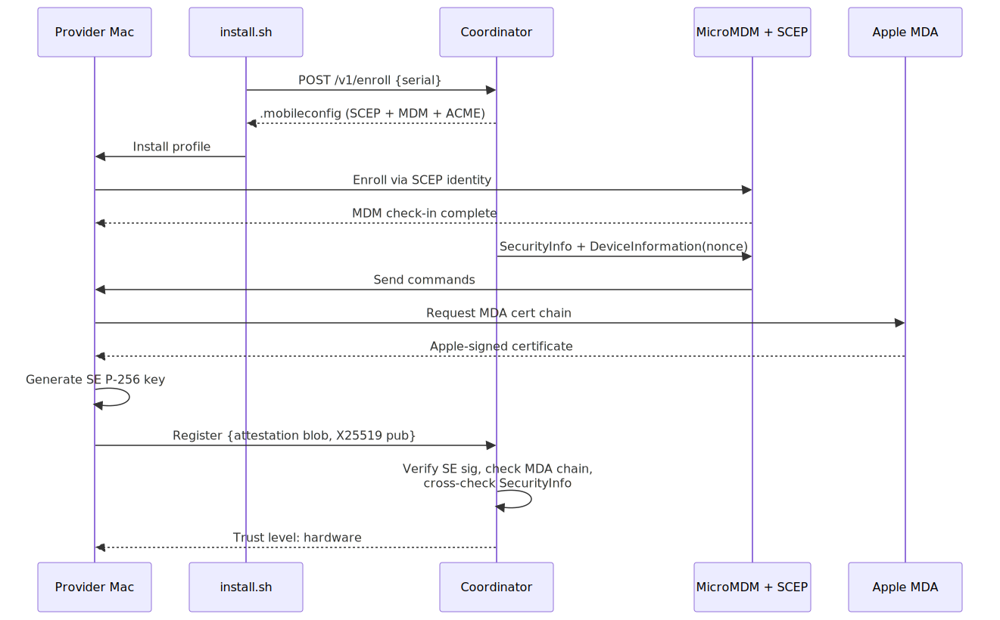

# Provider enrollment

Providers enroll by installing a single `.mobileconfig` profile generated by the coordinator. The profile combines MDM enrollment, SCEP device identity, and an ACME `device-attest-01` payload. The coordinator then uses MicroMDM to independently verify the device's security posture and to request an Apple-signed Managed Device Attestation (MDA) certificate chain.

## Enrollment flow



The diagram shows the sequence from `install.sh` requesting a signed profile through MicroMDM/SCEP enrollment to Apple MDA verification. The sections below describe the generated profile, the read-only MDM rights, and the verification checks.

## Enrollment endpoint

`POST /v1/enroll` accepts a serial number and returns a CMS-signed `.mobileconfig`. No authentication is required for the request itself; security comes from Apple's attestation during the ACME/MDA steps. Code:

- HTTP handler: `coordinator/api/enroll.go:19-81`
- Profile generation: `coordinator/api/enroll.go:113-266`

## Profile contents

The generated profile contains three payloads:

| Payload | Purpose | Key fields |
|---|---|---|
| SCEP | Device identity certificate for MDM | RSA 2048, CN = serial number, O = Darkbloom |
| MDM | Enroll with MicroMDM | `AccessRights = 1041` (read-only), `CheckOutWhenRemoved = true` |
| ACME | Apple device-attest-01 | `KeyType = ECSECPrimeRandom`, `KeySize = 384`, `HardwareBound = true`, `Attest = true` |

`AccessRights = 1041` means the coordinator can only inspect profiles and query device/security information. It cannot lock, wipe, install/remove profiles, or change settings. The exhaustive allowlist of MDM commands the coordinator will send is:

- `SecurityInfo`
- `DeviceInformation` (for `DevicePropertiesAttestation`)

Code:

- Read-only command gate: `coordinator/mdm/mdm.go:133-166`

## SecurityInfo verification

After enrollment, the coordinator asks MicroMDM to query `SecurityInfo`. The device reports:

- `SystemIntegrityProtectionEnabled`
- `SecureBoot.SecureBootLevel`
- `AuthenticatedRootVolumeEnabled`
- `FDE_Enabled`
- `IsRecoveryLockEnabled`

The coordinator cross-checks these values against the provider's self-reported attestation blob. A mismatch (for example, MDM says SIP is off while the provider claims it is on) marks the provider untrusted. Code:

- MDM verification flow: `coordinator/api/provider.go:2268-2339`
- MicroMDM client: `coordinator/mdm/mdm.go`

## Apple Device Attestation (MDA)

After `SecurityInfo` passes, the coordinator sends a `DeviceInformation` command requesting `DevicePropertiesAttestation`. The device contacts Apple's servers and returns a DER certificate chain signed by the Apple Enterprise Attestation Root CA.

Verification chain:

```
Apple Enterprise Attestation Root CA (P-384, embedded in coordinator)
  └─ Apple Enterprise Attestation Sub CA 1
      └─ Leaf cert (device identity)
          ├─ Serial number   (OID 1.2.840.113635.100.8.9.1)
          ├─ UDID            (OID 1.2.840.113635.100.8.9.2)
          ├─ OS version      (OID 1.2.840.113635.100.8.10.1)
          ├─ SepOS version   (OID 1.2.840.113635.100.8.10.2)
          ├─ Secure Boot level (OID 1.2.840.113635.100.8.13.2)
          └─ Freshness code  (OID 1.2.840.113635.100.8.11.1)
```

The coordinator verifies the chain against the embedded root CA, cross-checks the serial number against the provider's self-reported attestation, and stores the chain for public inspection. Code:

- MDA verification: `coordinator/attestation/mda.go:98-186`
- MDA dispatch and key binding: `coordinator/api/provider.go:2342-2429`

### SE key binding via freshness nonce

When requesting MDA, the coordinator supplies a `DeviceAttestationNonce` equal to the SHA-256 of the provider's SE public key. Apple embeds the raw bytes in the `FreshnessCode` OID, cryptographically binding the SE identity to the Apple-attested hardware. The coordinator checks `bytes.Equal(mdaResult.FreshnessCode, expectedFreshness[:])` before treating the MDA as bound. Code: `coordinator/api/provider.go:2350-2361`.

## ACME `device-attest-01` limitations

The enrollment profile still contains an ACME `device-attest-01` payload, but **it is not the operative production trust anchor today**. Several macOS platform limitations prevent it from being used the way earlier designs intended:

1. **Hardware-bound ACME identities are not usable by a third-party app.** On macOS, a `HardwareBound: true` ACME key is stored in the data-protection keychain inside a restricted system keychain access group. Only Apple system services (Wi-Fi/EAP-TLS, built-in VPN, MDM, Safari for mTLS) can use it. The Darkbloom provider process cannot call `SecItemCopyMatching` against that identity for signing or decryption. This is a documented platform limitation, not a configuration bug.
2. **The issued ACME certificate does not carry the SIP/SecureBoot OIDs.** The Apple-signed MDA-over-MDM certificate carries the security-state OIDs (`1.2.840.113635.100.8.13.*`); the ACME `device-attest-01` leaf used today does not.
3. **The mTLS ingress path is not functional today.** `coordinator/api/acme_verify.go` reads `X-Ssl-Client-*` headers populated by an mTLS-terminating reverse proxy, but no production ingress currently presents those headers for provider WebSocket connections.
4. **Key type mismatch.** The SE supports P-256 for the provider's attestation signing key, while the ACME payload requests P-384.

Because of these limitations, the active production path for hardware trust is:

- **MDA-over-MDM** for Apple-signed SIP/SecureBoot/hardware proof.
- **APNs code-identity attestation** for genuine-binary proof.

The ACME payload remains in the profile for future use. Removing it (or slimming the profile to ACME-only) would be unsafe until the ACME path can carry and verify the SIP OIDs and until the provider process can actually use the hardware-bound identity. This is documented explicitly because older drafts considered ACME-only enrollment. Code:

- ACME verification handler: `coordinator/api/acme_verify.go`
- ACME payload in profile: `coordinator/api/enroll.go:204-249`

## Trust upgrade flow

1. Provider registers with SE-signed attestation → trust level = `self_signed`.
2. MDM `SecurityInfo` passes → upgraded to `hardware`.
3. MDA certificate chain verifies and the serial number matches → MDA proof stored for public inspection.
4. APNs code-identity round-trip passes → `CodeAttested = true`, private traffic may route.

Code:

- Self-signed attestation and MDM upgrade path: `coordinator/api/provider.go:2195-2339`
- Trust level constants: `coordinator/registry/registry.go:52-57`
- Code-identity attestation: `coordinator/api/provider.go:487-617`

## Privacy and control boundaries

- The coordinator requests only read-only MDM rights.
- It cannot install/remove profiles, change settings, lock, or wipe the provider's Mac.
- The only commands it sends are `SecurityInfo` and `DeviceInformation`.
- The `.mobileconfig` is CMS-signed by the coordinator so the user sees a signed profile at install time.
