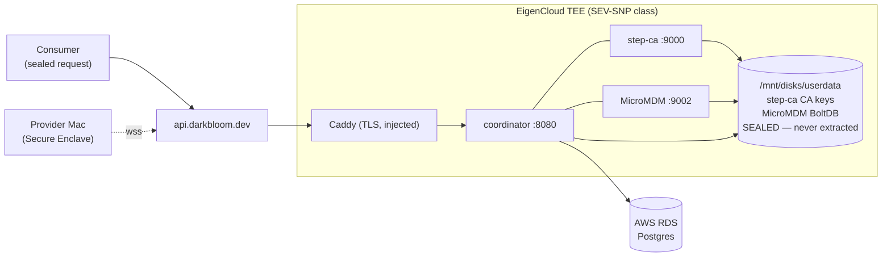
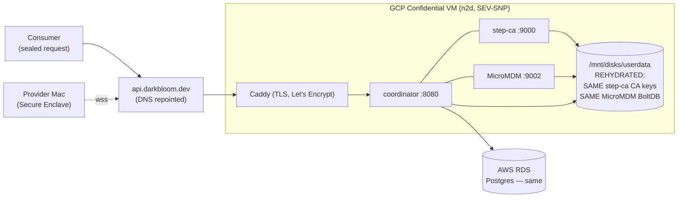

# DAR-70 — State Export Runbook (EigenCloud → GCP migration)

How the admin-gated `/data` state export works end-to-end, and the exact operator
flow to extract the TEE-sealed coordinator state and rehydrate it on a GCP
Confidential VM.

> **AI agents must NOT run this against prod.** Enabling the endpoint, deploying
> the export build to EigenCloud, and running the extraction are **human-only**
> actions (prod EigenCloud + KMS are human-only — see CLAUDE.md). This doc
> prepares the commands; a human executes them.

---

## What this solves

The prod coordinator's trust state is **born inside the EigenCloud TEE** and has
never left it:

- `/data/step-ca/` — the **root + intermediate CA private keys** that sign
  provider device-attest / SCEP certs.
- `/data/micromdm/` — the **MicroMDM BoltDB** (the enrolled-device database that
  the operative hardware-trust check, SecurityInfo, reads against), plus the push
  cert and the `.push_imported` sentinel.

EigenCloud gives no shell into `/mnt/disks/userdata`, so the only way to carry
this state to a GCP Confidential VM **without re-enrolling the whole fleet** is to
ship a coordinator build that can read it and emit it — encrypted to a key the
operator holds offline. That is `GET /v1/admin/state-export`.

Everything else the new coordinator needs is already portable: the env/KMS
secrets (operator has the `.env`), the `MNEMONIC` (carried byte-identical), and
the database (the same AWS RDS, cross-cloud).

---

## Before / After

### Before — prod on EigenCloud (sealed state never leaves the TEE)



### After — prod on GCP Confidential VM (same domain, same DB, rehydrated state)



The fleet sees no change: same `api.darkbloom.dev`, same CA that signed their
certs, same MicroMDM DB that holds their enrollment, same deposit/E2E `kid`
(`MNEMONIC` carried over).

---

## The extraction + rehydration flow

```mermaid
sequenceDiagram
  actor Op as Admin (human)
  participant Off as Offline machine<br/>(age identity)
  participant EC as EigenCloud coordinator
  participant GCP as GCP Confidential VM

  Note over Op,Off: 0. Prep (offline, once)
  Op->>Off: age-keygen -o identity.txt
  Off-->>Op: public recipient age1...

  Note over Op,EC: 1. Enable on prod (human-only KMS + deploy)
  Op->>EC: KMS set STATE_EXPORT_ENABLED=true,<br/>STATE_EXPORT_RECIPIENT=age1... + redeploy

  Note over Op,EC: 2. Extract (one request)
  Op->>EC: GET /v1/admin/state-export<br/>Authorization: Bearer ADMIN_KEY
  EC->>EC: gate: 404 if disabled / 403 if bad key
  EC->>EC: Phase A — snapshot+validate BoltDB,<br/>stage step-ca + micromdm (clean 500 on failure)
  EC->>EC: Phase B — zip, then age-encrypt to recipient
  EC-->>Op: darkbloom-state-<ts>.zip.age (encrypted stream)

  Note over Op,Off: 3. Decrypt + verify (offline)
  Op->>Off: age -d -i identity.txt -> .zip
  Off->>Off: unzip -l; open BoltDB read-only; check CA certs

  Note over Op,GCP: 4. Rehydrate BEFORE first coordinator boot
  Op->>GCP: unzip into /mnt/disks/userdata
  Op->>GCP: inject MNEMONIC + secrets; start coordinator
  GCP->>GCP: start.sh sees /data/step-ca/config -> PRESERVES (no re-init)
  GCP-->>Op: verify /v1/encryption-key kid matches;<br/>a known enrolled Mac reaches hardware trust

  Note over Op,EC: 5. Disable (human-only)
  Op->>EC: KMS set STATE_EXPORT_ENABLED=false + redeploy (endpoint -> 404)
```

---

## Exact operator commands

### 0. Generate the offline recipient keypair (once)

On a trusted, ideally offline machine:

```bash
age-keygen -o dar70-export-identity.txt
# prints: Public key: age1qz...   <-- this is the RECIPIENT
```

Keep `dar70-export-identity.txt` (the private identity) offline. Only the
`age1...` **public** recipient goes to the coordinator.

### 1. Enable the endpoint on prod EigenCloud (human-only)

Set via EigenCloud KMS and redeploy the coordinator build that contains the
endpoint:

```
EIGENINFERENCE_STATE_EXPORT_ENABLED=true
EIGENINFERENCE_STATE_EXPORT_RECIPIENT=age1qz...      # the offline public key
# EIGENINFERENCE_ADMIN_KEY is already set
```

Defaults are fail-closed: with `ENABLED` unset the route returns **404**; with no
recipient set and `ALLOW_PLAINTEXT` unset it returns **412** (encrypted-by-default).

### 2. Extract (one authenticated request)

```bash
curl -fSL https://api.darkbloom.dev/v1/admin/state-export \
  -H "Authorization: Bearer $EIGENINFERENCE_ADMIN_KEY" \
  -o darkbloom-state.zip.age
```

The coordinator snapshots the BoltDB consistently (hot-copy + validate + retry —
MicroMDM keeps the live DB locked), zips `step-ca/**` + `micromdm/**` (excluding
`*.log`, including `.push_imported`), and **age-encrypts the stream to your
recipient**. No plaintext is ever written to the coordinator's disk or logs.

### 3. Decrypt + verify (offline)

```bash
age --decrypt -i dar70-export-identity.txt -o darkbloom-state.zip darkbloom-state.zip.age

unzip -l darkbloom-state.zip            # expect step-ca/..., micromdm/micromdm.db, micromdm/.push_imported
unzip -d /tmp/verify darkbloom-state.zip
# sanity-check the BoltDB opens read-only and the CA certs are present:
ls -l /tmp/verify/step-ca/certs/        # root_ca.crt, intermediate_ca.crt (+ keys)
```

### 4. Rehydrate on the GCP Confidential VM — BEFORE first coordinator boot

The container's `start.sh` only initializes a fresh CA when `/data/step-ca/config`
is absent. Land the extracted tree at `/mnt/disks/userdata` **before** the
coordinator first runs, so the guard preserves it:

```bash
# copy the decrypted zip to the CVM, then on the CVM:
sudo mkdir -p /mnt/disks/userdata
sudo unzip -o darkbloom-state.zip -d /mnt/disks/userdata
# modes are preserved by the zip; confirm secrets stay tight:
sudo chmod 600 /mnt/disks/userdata/micromdm/push.key /mnt/disks/userdata/step-ca/secrets/password
```

Inject `MNEMONIC` (byte-identical) and the rest of the secret set into GCP Secret
Manager, then start the coordinator. **Verify before any DNS cutover:**

```bash
# kid must match prod EigenCloud (proves MNEMONIC continuity)
curl -s https://<cvm-staging-host>/v1/encryption-key | jq .kid
# then point one known-enrolled Mac at the CVM and confirm it reaches hardware trust
```

### 5. Disable the endpoint (human-only)

Immediately after a successful extraction:

```
EIGENINFERENCE_STATE_EXPORT_ENABLED=false   # (or unset) + redeploy → route returns 404 again
```

Then handle the artifacts per policy: the `.zip.age` is only decryptable with the
offline identity; destroy the decrypted `.zip` and `/tmp/verify` once rehydration
is verified.

---

## Security properties (why this is safe to ship)

- **Off by default** — the route is 404 unless `STATE_EXPORT_ENABLED=true`.
- **Admin-key only** — constant-time, length-leak-free (SHA-256 digests compared);
  the Privy-admin path is intentionally **not** accepted for this endpoint.
- **Encrypted by default** — the archive is age-encrypted to an offline recipient;
  a raw zip requires an explicit `STATE_EXPORT_ALLOW_PLAINTEXT=true`.
- **Consistent + fail-loud** — BoltDB is snapshotted with hot-copy + byte-level
  validation + retry; a torn copy or a degenerate (empty / missing MicroMDM DB)
  export fails as a clean pre-stream **500**, never a truncated 200.
- **No plaintext residue** — staged snapshots live in one `0700` temp dir that is
  always removed; nothing sensitive is logged (only counts, addr, outcome).

> The step-ca intermediate key is encrypted at rest under a password that is
> public in `deploy/start.sh`, so the transit encryption (age, to your offline
> key) is the real protection for the exported bytes. Treat the `.zip.age` and the
> offline identity accordingly.

---

## Where this sits in the migration

`DAR-69` (build the GCP CVM target) → **`DAR-70` (this — extract + rehydrate)** →
`DAR-105` (security review of the exfil path) → `DAR-71` (DNS cutover to the CVM,
rollback = revert DNS). The domain stays `api.darkbloom.dev` throughout; the
`.dev → .ai` move (`DAR-243`) is a separate, later project.
