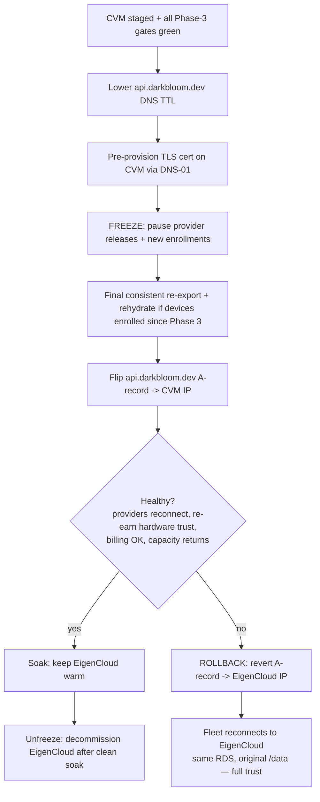

# EigenCloud → GCP Confidential VM Migration Runbook

How to move the prod coordinator off EigenCloud onto a GCP Confidential VM with **no fleet disruption**, and how to handle the `darkbloom.dev → darkbloom.ai` domain change (separately).

Tickets: `DAR-69` (build CVM target) → `DAR-70` (extract + rehydrate sealed state — see [`state-export.md`](state-export.md)) → `DAR-105` (security review) → `DAR-71` (cutover). `DAR-243` (`.ai`) is **decoupled**.

> **Prod EigenCloud, GCP prod deploys, KMS, and DNS are human-only.** AI agents may prepare PRs/commands; a human runs anything that mutates prod.

## Prerequisites

1. [ ] A fully configured **dev GCP environment** already running (`deploy/gcp/*`) so the container image, startup scripts, and Secret Manager wiring are known-good.
2. [ ] A **separate prod GCP project** with billing, IAM, and APIs enabled.
3. [ ] The **state-export runbook** reviewed and the offline `age` identity generated. See [`state-export.md`](state-export.md).
4. [ ] A decision on HA posture: CVMs can't live-migrate (`--maintenance-policy=TERMINATE`), so host maintenance reboots the box. With local-disk state (CA keys + BoltDB) there is **no clean multi-instance HA** — accept a single-CVM availability regression vs blue-green, or plan a maintenance-window posture.
5. [ ] `DAR-105` policy sign-off: confirm that a one-shot in-TEE export of the CA key to an offline-held key is acceptable, or choose the alternative (re-key on GCP + full fleet re-enroll).
6. [ ] Confirmation that the domain stays `api.darkbloom.dev` for this move (scopes `DAR-243` out).

## The core idea: this is a state move, not a rebuild

The **dev environment already is the GCP target shape** (`deploy/gcp/*`: GCE VM + Docker + systemd + host Caddy + Secret Manager + the same `/mnt/disks/userdata` path, so the container's `start.sh` runs unchanged). So the migration is **not** an infra-build problem — it's a **state-continuity** problem with three deltas:

1. **Confidential-compute** flags on the VM (preserve the TEE memory-encryption property).
2. The **prod secret set** in GCP Secret Manager.
3. The **sealed-state lift** (`DAR-70`) — the only thing that can't otherwise leave EigenCloud.

## What makes it smooth (five invariants)

| Invariant | Why it keeps the fleet/consumers unaware |
|---|---|
| **Keep `api.darkbloom.dev`** — repoint DNS only | The MDM `ServerURL` is baked into every enrolled device's profile, and the provider binary self-heals to `wss://api.darkbloom.dev`. Same host = nothing to re-enroll or re-release. |
| **Keep the same AWS RDS** (cross-cloud) | The store is DSN-portable → zero data migration; users/balances/releases/providers all just work. |
| **Lift the sealed state faithfully** (`DAR-70`) | Same step-ca CA that signed device certs + same MicroMDM BoltDB → providers re-earn hardware trust normally. |
| **Carry `MNEMONIC` byte-identical** | Same X25519 `kid` on `/v1/encryption-key` → sealed senders don't break. |
| **Stage + verify everything before the DNS flip; roll back by reverting DNS** | The cutover is a single, reversible DNS change with EigenCloud kept warm. |

## Steps

### Phase 1 — Build the prod GCP Confidential VM (`DAR-69`)

Parameterize the dev scripts into a **separate prod GCP project** and add confidential-compute. Stand up an **empty** CVM that boots the unchanged container; verify; then discard its throwaway `/data`.

- Update `bootstrap.sh` for prod:
  - `MACHINE_TYPE e2-small → n2d-standard-2` (e2 can't run confidential).
  - Add to the instance create:
    ```
    --confidential-compute-type=SEV_SNP --maintenance-policy=TERMINATE \
    --shielded-secure-boot --shielded-vtpm --shielded-integrity-monitoring
    ```
- **Boot-time confidential assertion** (Phase-1 blocker): the coordinator (or vm-startup) must verify it's actually on a confidential VM and refuse to serve if not. Omitting the flag silently produces a non-confidential VM where the host can read decrypted prompts, with zero error today.
- Host **Caddy** for `api.darkbloom.dev` (Let's Encrypt). The in-container `coordinator/Caddyfile` (EigenCloud-injected `/run/tls/`) is not used on the VM.
- Point at the **same RDS** (drop the dev `cloud-sql-proxy` unit; `sslmode=require`).
- **Secret Manager parity** — include what the dev wiring has plus anything prod-specific: `APNS_*` and `EIGENINFERENCE_MDM_WEBHOOK_SECRET`. Add `MNEMONIC` + `MICROMDM_API_KEY` to `CRITICAL_VARS` in `refresh-env.sh` (an empty value boots a broken coordinator with no abort — empty `MICROMDM_API_KEY` skips MicroMDM entirely → fleet outage).
- Set `DD_ENV=production` + prod hostname so prod dashboards/monitors aren't polluted.

Verification before proceeding:

```bash
# Empty CVM boots and serves /health
curl https://<cvm-staging-host>/health
# Confidential compute assertion passes (check coordinator logs)
```

### Phase 2 — Extract the sealed state (`DAR-70`)

Human ships the export build to EigenCloud and runs the one-shot extraction per [`state-export.md`](state-export.md). Output: an age-encrypted archive of `step-ca/**` + `micromdm/**`, decrypted offline.

### Phase 3 — Rehydrate + verify on the CVM (no prod traffic yet)

1. Land the decrypted `/data` at `/mnt/disks/userdata` **before** the coordinator's first boot (so `start.sh`'s `if [ ! -d /data/step-ca/config ]` guard preserves the real CA).
2. Inject `MNEMONIC` (byte-identical) + the full secret set.
3. Boot the CVM on a **staging hostname**.
4. Run the verification gates from [`state-export.md`](state-export.md):
   - `GET /v1/encryption-key` `kid` == prod EigenCloud's (proves `MNEMONIC` continuity).
   - A known-enrolled Mac pointed at the CVM completes a MicroMDM SecurityInfo round-trip and reaches hardware trust.
   - SCEP re-enroll + ACME cert renewal chain to the carried step-ca.
   - APNs attestor logs ENABLED; MDM webhook returns 200 (not 403).

### Phase 4 — Cutover (`DAR-71`)



**Smoothness details that bite if skipped:**

- **TLS cold-start:** at the flip the CVM's Caddy needs a valid `api.darkbloom.dev` cert *before* traffic arrives. Pre-provision via **DNS-01**; HTTP-01 needs DNS already pointing at the CVM and causes a brief all-HTTPS outage.
- **Freeze enrollment + releases:** otherwise (a) a device enrolled during the window is stranded if you roll back to EigenCloud's older BoltDB, and (b) a `POST /v1/releases` could register on the soon-dead instance.
- **Shared-RDS overlap:** both coordinators briefly share one RDS. Keep exactly **one active Stripe webhook target** and drain EigenCloud first to shrink the window.
- **Rollback is just the DNS revert** — fast, bounded by the pre-lowered TTL. EigenCloud retains the original `/data` + same RDS.

## Verification

| Gate | How to verify |
|---|---|
| `MNEMONIC` byte-identical | `curl https://<cvm>/v1/encryption-key \| jq .kid` matches prod EigenCloud |
| Sealed state rehydrated | Known-enrolled Mac reaches hardware trust against the CVM |
| CA continuity | SCEP re-enroll / ACME renewal succeeds |
| MDM continuity | APNs attestor ENABLED; MDM webhook 200 |
| Traffic health | `/v1/stats` returns capacity; consumer chat round-trip succeeds |
| No split-brain | Only one Stripe webhook target active during overlap |

## Rollback

- **Before DNS cutover:** do not flip DNS. Prod stays on EigenCloud.
- **After DNS cutover:** revert the `api.darkbloom.dev` A-record to the EigenCloud IP. The fleet reconnects to the original coordinator with its original `/data` and the same RDS; trust re-earns normally.
- **If the CVM is corrupted before rehydration:** stop it before first boot, fix `/mnt/disks/userdata`, and retry. If `start.sh` already initialized a fresh CA, wipe `/mnt/disks/userdata/step-ca/config` and re-export from EigenCloud.

## Changing the domain (`darkbloom.dev → darkbloom.ai`) — DECOUPLE it

Do the substrate move first on the stable domain. The `.ai` rename is its **own later project**, because two bindings make a simultaneous switch dangerous:

1. **MDM `ServerURL`** is baked into every already-enrolled device's installed `.mobileconfig` (`micromdm serve -server-url https://${DOMAIN}`). If `api.darkbloom.dev` stops serving, devices can't answer SecurityInfo → the hardware-trust path fails → fleet de-routes under `MIN_TRUST=hardware`.
2. The **provider binary self-heals** to `wss://api.darkbloom.dev/ws/provider` on every startup, so a config-only domain switch is silently reverted.

### How to do `.ai` additively (when you choose to)

```mermaid
flowchart LR
    P1[Register darkbloom.ai DNS + TLS] --> P2[Parallel-serve BOTH hosts<br/>Caddy accepts .dev and .ai]
    P2 --> P3[New signed/notarized provider release<br/>default -> .ai, .dev fallback]
    P3 --> P4[New .ai enroll profiles<br/>reuse Payload UUIDs so SE key isn't orphaned]
    P4 --> P5[Re-enroll + fleet auto-update campaign]
    P5 --> P6[Update Privy callbacks, Stripe webhooks,<br/>console CSP + hardcoded ATTESTATION_API, emails]
    P6 --> P7[Telemetry: zero devices/providers on .dev?]
    P7 --> P8[Retire .dev — keep as permanent redirect until then]
```



- **Keep `api.darkbloom.dev` alive as a permanent alias** as long as *any* device is enrolled against it. It can't be hard-cut.
- Already domain-independent (no change): the model CDN `models.darkbloom.ai` and the APNs topic (Apple bundle ID `io.darkbloom.provider`).
- Code touch-points for `.ai`: `coordinator/Caddyfile` (single `{$DOMAIN}` block → accept two names), `coordinator/api/{server,consumer,device_auth,enroll}.go` + `install.sh`, the console-ui `darkbloom.dev` references + the hardcoded `ATTESTATION_API`/CSP `connect-src`, and the `prod.env` URLs.

## One-screen blast-radius checklist

- [ ] `MNEMONIC` byte-identical (kid match verified) — **in `CRITICAL_VARS`**
- [ ] `MICROMDM_API_KEY` present — **in `CRITICAL_VARS`** (empty ⇒ MicroMDM skipped ⇒ outage)
- [ ] step-ca CA keys + MicroMDM BoltDB rehydrated (consistent snapshot; a real device reaches hardware trust)
- [ ] `APNS_*` + `EIGENINFERENCE_MDM_WEBHOOK_SECRET` in Secret Manager (confirm prod has them)
- [ ] RDS network path proven from GCP; `sslmode=require`
- [ ] `--confidential-compute-type=SEV_SNP` + boot-time confidential assertion
- [ ] Caddy cert pre-provisioned (DNS-01) before flip; port 80/443 open
- [ ] `DD_ENV=production` + prod hostname; monitors re-pointed
- [ ] Enrollment + provider releases frozen during the window
- [ ] Single Stripe webhook target during overlap
- [ ] EigenCloud kept warm; DNS TTL pre-lowered; rollback = revert A-record
- [ ] `DOMAIN=api.darkbloom.dev` unchanged (`DAR-243` out of scope)
