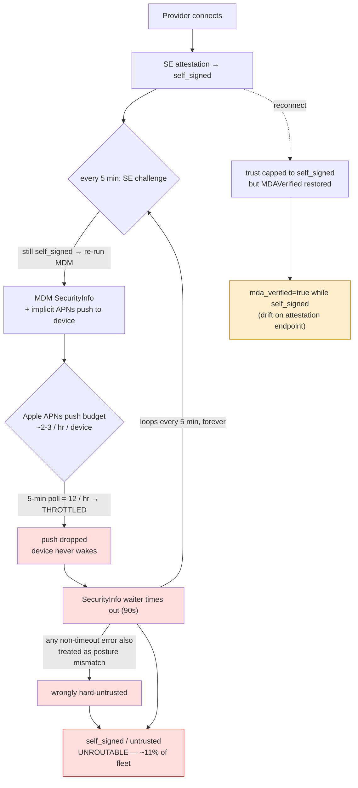
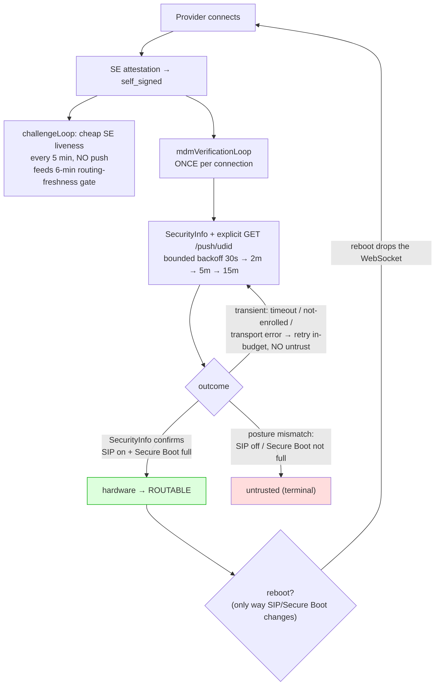

# Provider Trust Reliability

How a provider earns **hardware** trust, why ~11% of the fleet got stranded at
`self_signed`/`untrusted`, what the per-connection MDM fix changed, and how to
observe and activate the (currently dormant) ACME device-cert leg.

This is engineer-facing operational doc, not a spec. It does **not** change
trust-grant semantics — hardware trust still requires a genuine, Apple-attested
device. It makes the existing OR-trust model reliable and observable.

---

## At a glance: before vs after

**Before** — MDM `SecurityInfo` was re-run on the 5-minute challenge for every
`self_signed` provider. Each run pushed via APNs; Apple throttles those, so the
checks timed out and the provider never escaped `self_signed`:



**After** — the cheap SE liveness challenge stays on its ticker; MDM
`SecurityInfo` moves to a per-connection loop with an explicit push and a
push-budget-aware backoff. The check lands once and trust sticks for the
connection (a reboot — the only way SIP/Secure Boot can change — drops the
WebSocket and forces a fresh, re-verified connection):



---

## 1. The problem

Hardware trust via MDM is established by issuing a live **SecurityInfo** command
over the MicroMDM → APNs → device channel and reading back the device's SIP /
Secure Boot posture. The old model ran this verification at registration **and
re-ran it on every 5-minute challenge** for any provider still at `self_signed`.

Each re-verification fired a fresh MDM/APNs push. Apple throttles MDM pushes
aggressively, so under steady fleet load most of those pushes were dropped or
delayed past the SecurityInfo wait timeout. The check never landed, the provider
stayed `self_signed`, the next 5-minute tick pushed again, and the cycle
repeated. Net effect: roughly **11% of the fleet was stranded** unroutable at
`self_signed`/`untrusted` even though the machines were genuine, enrolled Apple
hardware — the trust path was self-inflicting an APNs throttle.

Two **drift / mis-classification** bugs compounded the noise (neither was a
trust *downgrade* — a SecurityInfo timeout already stayed `self_signed` without
untrusting):

1. **Display drift:** on reconnect, trust is capped back to `self_signed` but the
   stored `MDAVerified`/`ACMEVerified` flags (and the late-MDA cert payload) were
   resurrected, so `/v1/providers/attestation` showed `mda_verified=true` next to
   a `self_signed` provider — misleading anyone verifying a provider's hardware.
2. **Outcome mis-classification:** the verify path treated *any* non-timeout
   error as a posture mismatch — so a transient MicroMDM transport hiccup (the
   SecurityInfo command failing to enqueue) would wrongly **hard-untrust** an
   enrolled, genuinely-secure box. Only a SecurityInfo response that actually
   reports SIP-off / Secure-Boot-not-full (or disagrees with the attestation) is
   a real mismatch.

---

## 2. The shipped fix

The verification model moved from **poll-forever-per-challenge** to
**once-per-connection, retried within the connection**:

- **`mdmVerificationLoop` (per connection).** Spawned alongside the challenge
  loop when a provider connects (`api/provider.go`). It owns SecurityInfo
  verification for the lifetime of that one WebSocket and stops the moment
  hardware is earned (here or via the ACME leg concurrently), on a terminal
  posture mismatch, or when the connection closes.
- **Explicit push + bounded backoff.** It sends the SecurityInfo command, then
  retries on a fast→slow schedule (`30s, 2m, 5m`, then a 15-minute steady
  cadence) — enough to survive APNs / Power-Nap delivery delay and to catch a
  device that finishes enrollment mid-connection, while staying well under
  Apple's push budget. It is **not** re-pushed on every 5-minute challenge.
- **Transient ≠ untrust.** A miss/timeout/not-enrolled outcome is now treated as
  *transient* — it schedules a retry and never downgrades a provider that
  already holds trust. Only a real posture mismatch is terminal. This fixes the
  drift downgrade.
- **Observability gauges.** `providers.by_trust_status` and
  `providers.by_mdm_failure` (see §6) make the stuck cohort and its cause
  visible.

### Why per-connection is security-equivalent to polling

SIP and Secure Boot posture **cannot change at runtime**. Both require a reboot
into Recovery to alter. A reboot drops the WebSocket, which ends
`mdmVerificationLoop` and forces a fresh connection that re-verifies from
scratch. So there is no window in which a machine flips its security posture
while keeping a live, already-verified connection. We don't need to re-poll a
stable property; we only need the one check to *land* — which the bounded
in-connection retry now reliably achieves without spamming APNs.

---

## 3. The OR-trust model

Hardware trust is granted by **either** path — it is already an OR:

```
TrustHardware  ==  valid+bound ACME device-attest-01 client cert   (no live MDM command)
                OR live MDM SecurityInfo posture check passes       (MicroMDM → APNs → device)
```

- **MDM SecurityInfo** (`verifyProviderViaMDM`): the live-command path described
  above. Operative in prod today.
- **ACME device-attest-01** (`applyACMETrust`, `api/acme_verify.go`): the
  provider presents an mTLS client certificate at WebSocket connect. The cert
  was issued by step-ca only after Apple's ACME `device-attest-01` challenge
  proved the CSR key lives in this machine's Secure Enclave. Verifying the cert
  chain against the step-ca root — plus binding it to the provider's attested SE
  key — proves genuine Apple hardware **with no live MDM/APNs round-trip at
  all**. This is the throttle-immune leg.

  `applyACMETrust` runs at connect but the attestation challenge hasn't
  completed yet, so the binding checks fail on ordering; the result is stashed
  (`stashPendingACME`) and re-applied by `retryACMETrust` once the SE-key
  binding lands. Exit outcomes are now counted (`acme.trust`, §6).

### ACME is currently DORMANT

In prod, **zero** ACME verifications are observed. The cert-presentation leg is
not wired end to end:

1. **step-ca must issue the cert.** `enroll.go` already provisions the ACME
   `device-attest-01` payload in the enrollment `.mobileconfig` (payload type
   `com.apple.security.acme`, ACME path `eigeninference-acme`), so the client
   side is ready — but step-ca must actually be running and issuing on that
   path.
2. **The ingress must do mTLS client auth** and forward the client cert to the
   coordinator as `X-Ssl-Client-Verify` / `X-Ssl-Client-Cert` /
   `X-Ssl-Client-Dn` headers (the headers `extractAndVerifyClientCert` reads).
3. **`EIGENINFERENCE_STEP_CA_ROOT` must be set** (and optionally
   `EIGENINFERENCE_STEP_CA_INTERMEDIATE`). Without the root,
   `extractAndVerifyClientCert` returns early and the entire leg is off. The
   coordinator now logs a **WARN at startup** when this is unset.

**Activating ACME is out of scope here** — it needs deploy-architecture
confirmation (is the ingress actually terminating mTLS? is step-ca issuing on
this path?). This change only makes the dormant-vs-active state observable so
activation can be validated.

> **SECURITY GATE — do NOT activate ACME without this.** Today `applyACMETrust`
> grants `hardware` on (a) the cert chaining to the step-ca root and (b) the cert
> key matching the attested SE key. It does **not** independently verify the
> device's **SIP / Secure Boot** posture — it implicitly trusts step-ca's
> issuance policy, and a cert's posture is *issuance-time*, not live. While ACME
> is dormant this grants nothing, so it is not a live hole. But activating ACME
> as-is would make `hardware` trust reachable with a *weaker* posture guarantee
> than MDM SecurityInfo (the exact privacy invariant the gate exists to protect:
> real traffic only to genuinely SIP-on / Secure-Boot-full hardware). Before
> activation, `extractAndVerifyClientCert`/`applyACMETrust` MUST **fail closed**
> unless the cert's Apple device-attest extensions assert SIP enabled + Secure
> Boot full (OIDs `1.2.840.113635.100.8.13.*`, parsed by `attestation/mda.go`),
> **and** the certs must be short-lived / re-attested per connection so the
> posture is fresh (a long-lived cert lets a box that later disables Secure Boot
> keep presenting an "all good" cert). Implement that OID posture check as step 1
> of activation, with a test, before wiring step-ca + ingress mTLS.

To validate activation once wired: watch `acme.client_cert{outcome:present_valid}`
climb (certs are reaching us and verifying) and `acme.trust{outcome:granted}`
follow (those certs are upgrading providers to hardware). See §6.

---

## 4. MDA is identity, not a reliability path

Apple Device Attestation (MDA / `DevicePropertiesAttestation`,
`verifyAppleDeviceAttestation`) is sometimes mistaken for a third reliability
escape hatch. It is not.

- MDA rides the **same live MicroMDM → APNs command channel** as SecurityInfo
  (it's a `DeviceInformation` command). It is subject to the same APNs delivery
  constraints, so it cannot bypass an MDM/APNs throttle.
- Its purpose is **identity + anti-relay**: Apple signs a cert chain binding the
  device to genuine hardware, and the SE-key hash is carried as the attestation
  nonce (embedded as FreshnessCode, OID `1.2.840.113635.100.8.11.1`) so the SE
  key is cryptographically bound to *this* machine. That stops a relay attack
  where one machine answers attestation on behalf of another.

So MDA strengthens *who* a provider is; it does not make trust *more reliable*
to obtain. Don't reach for it to solve an APNs-delivery problem — that's what the
ACME leg (no live command) is for.

**SIP / Secure Boot posture** is available Apple-signed from **either**
SecurityInfo (live) **or** the ACME device cert's attestation extensions (OIDs
`1.2.840.113635.100.8.13.*`). The ACME leg therefore carries the same posture
evidence without a live command, which is exactly why activating it removes the
APNs dependency for the providers that present a cert.

---

## 5. The enrollment-completion gap

A provider that never reaches hardware trust usually has an incomplete MDM
enrollment, not a coordinator bug. The two distinct failure shapes (both bucketed
into `providers.by_mdm_failure`, both surfaced by `darkbloom doctor`):

| Reason (`MDMFailureReason`) | Meaning | Provider-side fix |
|---|---|---|
| `device-not-found` | The enrollment profile was never checked in to MicroMDM at all — MicroMDM has no record of this serial. | Re-install / repair the enrollment profile; confirm the `.mobileconfig` from `/v1/enroll` was actually installed and the MDM payload accepted. |
| `found-not-enrolled` | MicroMDM knows the serial but check-in is incomplete — the device record exists but isn't fully enrolled/responsive. | Finish enrollment (approve MDM in System Settings), then keep the Mac awake and APNs reachable so the check-in completes. |
| `securityinfo-timeout` | Enrolled, but the SecurityInfo push didn't return in time (APNs/Power-Nap delay). | Keep the Mac awake (disable sleep / Power Nap throttling); confirm APNs reachability. The in-connection retry will catch it once a push lands. |
| `posture-mismatch` | Terminal — device reported SIP/Secure Boot disabled. | Re-enable SIP and Secure Boot (reboot into Recovery). |
| `error` | Verification call errored. | Inspect coordinator logs for this provider. |

General provider-side remedies: finish/repair the MDM enrollment profile, keep
the Mac awake (so APNs pushes are delivered promptly), and ensure outbound APNs
connectivity. `darkbloom doctor` reports the local view of enrollment + SE key +
attestation so a provider operator can self-diagnose before the coordinator ever
has to.

---

## 6. Monitoring

Datadog gauges/counters to watch and alert on.

**Trust-cohort gauges** (emitted on a ticker, `api/server.go`):

- `providers.by_trust_status{trust_level,status}` — providers bucketed by trust
  level and status. **Alert** when the `self_signed`/`untrusted` cohort grows or
  fails to shrink — that's the stranded fleet.
- `providers.by_mdm_failure{reason}` — connected, non-hardware providers bucketed
  by `MDMFailureReason` (§5). Tells you *why* the stuck cohort is stuck:
  - rising `device-not-found` / `found-not-enrolled` → provider-side enrollment
    problem (action is on the operators / onboarding).
  - rising `securityinfo-timeout` → MDM/APNs delivery problem (the thing the
    per-connection fix mitigates; sustained growth means APNs is degraded or the
    push budget is again exhausted).
  - any `posture-mismatch` → genuinely insecure machines, expected to stay
    untrusted.

**ACME counters** (new in this change):

- `acme.client_cert{outcome}` — emitted once per provider connect in
  `extractAndVerifyClientCert`:
  - `missing` — no client cert reached the coordinator (provider didn't present
    one, or the ingress isn't forwarding `X-Ssl-Client-*` headers). **While ACME
    is dormant this is expected to be ~100%.** Once activated, a stuck-high
    `missing` rate means the ingress mTLS forwarding is broken.
  - `present_invalid` — a cert was forwarded but failed nginx verify / PEM
    parse / chain verification / key encoding. Indicates an issuance or
    chain-of-trust problem.
  - `present_valid` — cert parsed and verified against the step-ca root.
- `acme.trust{outcome}` — emitted at each `applyACMETrust` exit:
  - `nil_or_invalid` — no usable ACME result (the dormant default).
  - `not_bound` — cert valid but the SE-key attestation hasn't bound yet; the
    stash/retry path will re-apply after the challenge. Persistent `not_bound`
    without an eventual `granted` means the retry isn't completing.
  - `key_mismatch` — terminal: the cert's public key doesn't match the attested
    Secure Enclave key. **Alert** — this is a relay/mismatch signal.
  - `granted` — provider upgraded to hardware via ACME.

**Startup signal:** the WARN
`ACME device-cert verification disabled — EIGENINFERENCE_STEP_CA_ROOT not set; …`
tells you at boot whether the ACME leg is even configured. Its absence (i.e. the
companion `step-ca ACME client cert verification enabled` Info log) confirms the
root is loaded.

**Validation playbook for ACME activation:** after wiring step-ca + ingress mTLS
+ `EIGENINFERENCE_STEP_CA_ROOT`, restart and confirm the startup WARN is gone,
then watch `acme.client_cert{outcome:present_valid}` rise as providers reconnect,
followed by `acme.trust{outcome:granted}`, and a corresponding shrink of the
`self_signed` cohort in `providers.by_trust_status`.
